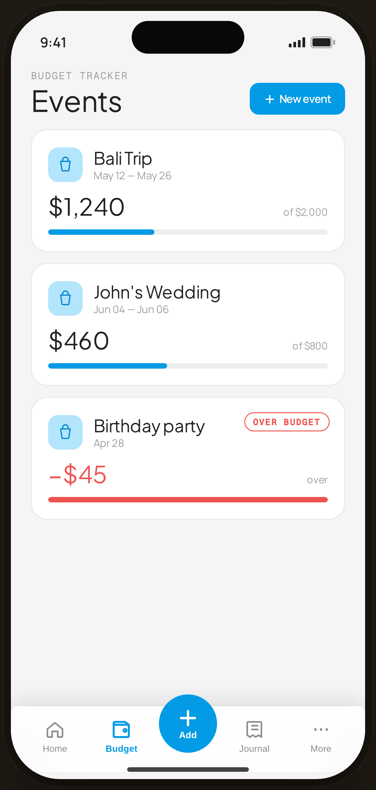

# Event Budget · 3 active (1 over) — Flow 06 · Event Budget

`event-list` · artboard 414×868

## Purpose
The populated Events list (`<ScreenEventBudgetHi />`): active event budget cards, including one over-budget state.

## Layout (top → bottom)
- Phone chrome.
- **Header** (14×22): mono "BUDGET TRACKER"; serif 32px "Events"; right primary "＋ New event" (sm).
- Scroll body — 3 event cards (12px gap), each: 38px blue-tint events icon + serif name + date range; a row with serif remaining amount + "of $budget"; a progress bar.
  - **Birthday party** card adds an "OVER BUDGET" pill and renders the figure/bar in red.
- **Floating bottom nav** (`active="budget"`).

## Components & content
- Events: **Bali Trip** (May 12 — May 26) $1,240 of $2,000 (on-track); **John's Wedding** (Jun 04 — Jun 06) $460 of $800 (on-track); **Birthday party** (Apr 28) −$45 over (budget $400, "OVER BUDGET").
- Copy: `BUDGET TRACKER`, `Events`, `New event`, `Over budget`, `over`, `of $…`.

## Typography & color
- Names `--serif` 19px; amounts `--serif` 26px.
- On-track bar/amount `--blue-500` #039be5; over-budget amount/bar/pill `--danger` #ef5350 (bar at 100%).

## States & interactions
- `pct = min(100, (budget-remaining)/budget*100)`. Over-budget card clamps the bar and switches to red + pill. Cards tap → `event-detail`.

## Implementation notes
- `events[]` array local with `state: 'on'|'over'`. Reuses `PhoneShell`, `ProtoBottomNav`, `Button`, `Icon`, `currencyFmt`.
