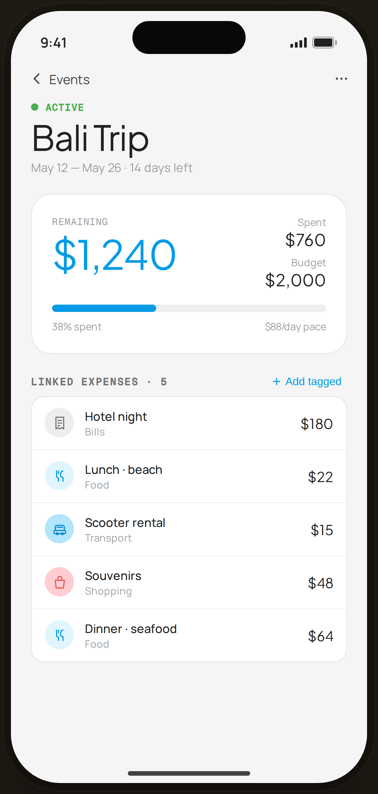

# Event Detail · Bali Trip — Flow 06 · Event Budget

`event-detail` · artboard 414×868

## Purpose
A single event's detail (`<ScreenEventDetailHi />`): status, budget hero with spend/remaining, and the list of tagged expenses.

## Layout (top → bottom)
- Phone chrome.
- **NavBar** — back "‹ Events", right "⋯".
- Scroll body:
  - **Status header** — green dot + mono "ACTIVE"; serif 38px "Bali Trip"; "May 12 — May 26 · 14 days left".
  - **Hero card** (radius 22) — "REMAINING" serif 44px "$1,240" (blue); right column Spent $760 / Budget $2,000; progress bar at 38%; footer "38% spent · $88/day pace".
  - **Linked expenses · 5** section (with "＋ Add tagged") — card of 5 rows: CatBadge · note/category · serif amount.

## Components & content
- Copy: `ACTIVE`, `Bali Trip`, `May 12 — May 26 · 14 days left`, `REMAINING`, `$1,240`, `Spent $760`, `Budget $2,000`, `38% spent`, `$88/day pace`, `Linked expenses · 5`, `Add tagged`.
- Linked: Hotel night (Bills) $180, Lunch · beach (Food) $22, Scooter rental (Transport) $15, Souvenirs (Shopping) $48, Dinner · seafood (Food) $64.

## Typography & color
- Status eyebrow & dot `--sage` #4caf50; remaining amount `--blue-500` #039be5 serif 44px.
- Progress fill `--blue-500` on `--gray-200`.

## States & interactions
- Active (on-track) event. Closed/over-budget variants are `edge-event-closed` / `edge-event-warn`. "Add tagged" links an expense to this event.

## Implementation notes
- `tagged[]` list + budget figures hard-coded. Reuses `PhoneShell`, `NavBar`, `BackBtn`, `SectionTitle`, `CatBadge`, `Icon`, `currencyFmt`.
