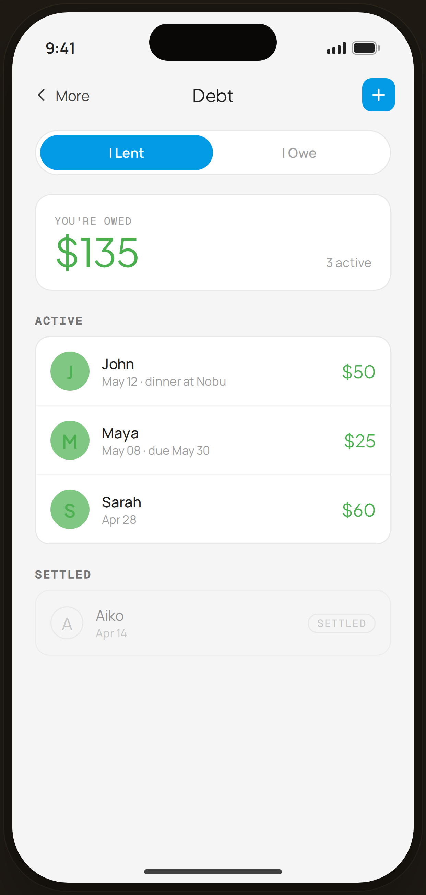

# Debt · I Lent — Flow 07 · Debt & Lending

`debt-lent` · artboard 414×868

## Purpose
The debt tracker, "I Lent" view (`<ScreenDebtTrackerHi view="lent" />`): money owed back to the user, with active and settled records.

## Layout (top → bottom)
- Phone chrome.
- **NavBar** — back "‹ More", center "Debt", right blue ＋ tile.
- Scroll body:
  - **I Lent / I Owe** segmented toggle (I Lent active, blue).
  - **Summary card** — mono "YOU'RE OWED"; serif 38px total (green) + "3 active".
  - **Active** list — 3 rows: initial avatar (green tint) · name · date·note · serif amount (green).
  - **Settled** list — faded, with a "settled" pill (Aiko · $20).

## Components & content
- Active (lent): John $50 (May 12 · dinner at Nobu), Maya $25 (May 08 · due May 30), Sarah $60 (Apr 28). Settled: Aiko $20 (Apr 14). Total owed = $135.
- Copy: `Debt`, `I Lent`, `I Owe`, `YOU'RE OWED`, `3 active`, `Active`, `Settled`.

## Typography & color
- Total & amounts `--serif`; "I Lent" toggle fill `--blue-500`.
- Lent accent `--sage` #4caf50 (amounts + avatar tint `--sage-soft`).

## States & interactions
- `view="lent"`: green semantics (money coming back); settled section shown for lent. Toggle switches to `debt-owe`. ＋ opens add-record sheet (`debt-add`). Rows tap → `debt-lent-detail`.

## Implementation notes
- `lent`/`owe`/`settled` arrays local; total summed from active. Reuses `PhoneShell`, `NavBar`, `BackBtn`, `SectionTitle`, `Icon`, `currencyFmt`. `Toggle` local.
