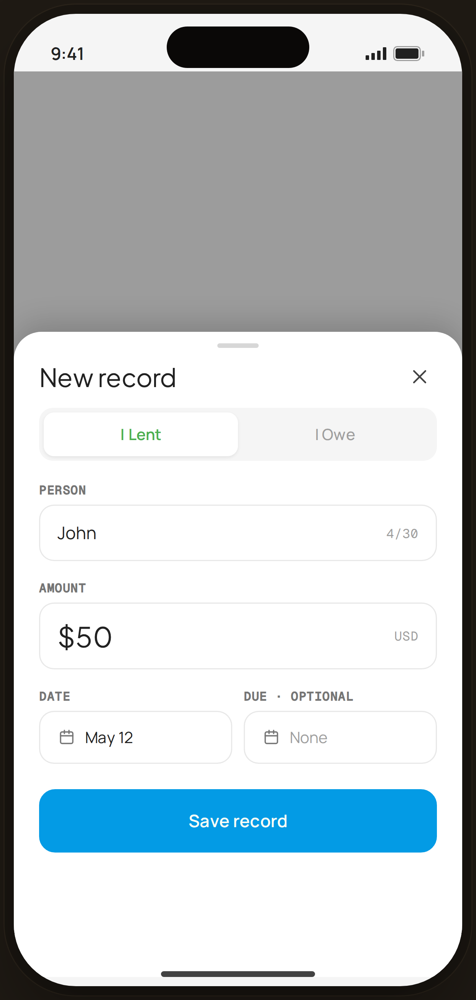

# Add Record — Flow 07 · Debt & Lending

`debt-add` · artboard 414×868

## Purpose
The "New record" bottom sheet for adding a lent/owed entry (`<DebtAddRecord />`).

## Layout (top → bottom)
- Phone chrome (plain paper behind).
- **Bottom sheet** (`EdgeBottomSheet`, height 560) over scrim:
  - Handle + title "New record" + close.
  - **I Lent / I Owe** segmented toggle (I Lent active, white pill, sage text).
  - **Person** field — "John" + mono "4/30" counter.
  - **Amount** field — serif "$50" + mono "USD".
  - **Date** field — calendar "May 12"; **Due · optional** field — calendar "None" (muted).
  - **Save record** primary button.

## Components & content
- Copy: `New record`, `I Lent`, `I Owe`, `Person`, `John`, `4/30`, `Amount`, `$50`, `USD`, `Date`, `May 12`, `Due · optional`, `None`, `Save record`.
- DS components: `Button` primary/lg/fullWidth; local `Field`, `NavLabel`.

## Typography & color
- Labels `--mono` uppercase `--ink-3`; amount `--serif` 24px.
- Active "I Lent" pill: white bg, soft shadow, `--sage` #4caf50 text. CTA `--clay` #039be5.

## States & interactions
- Toggle chooses lent vs owe (changes accent semantics). Due date optional. Same-person-opposite-side conflict surfaces a warning (`edge-debt-conflict`).

## Implementation notes
- Static, values hard-coded. Reuses `PhoneShell`, `EdgeBottomSheet`, `Field`, `NavLabel`, `Button`, `Icon`.
