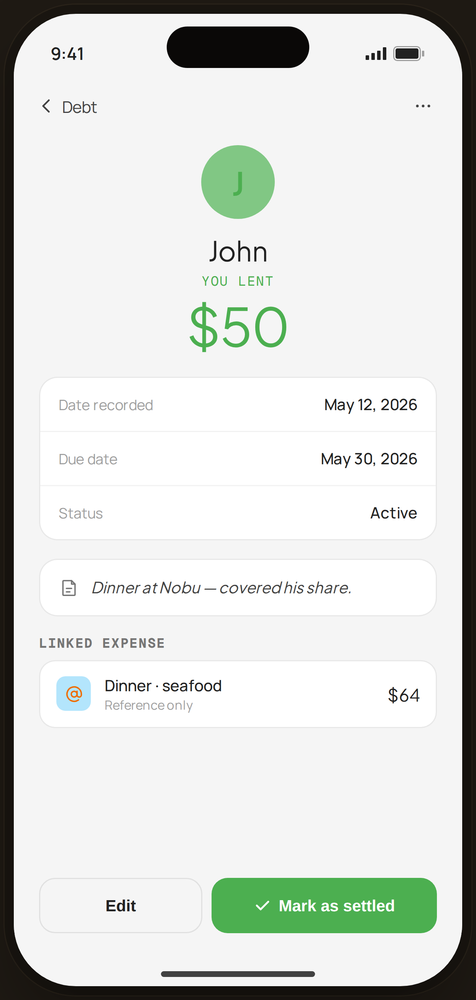

# Debt Detail · Lent · John — Flow 07 · Debt & Lending

`debt-lent-detail` · artboard 414×868

## Purpose
Detail of a lent record (`<ScreenDebtDetailHi view="lent" />`): who owes the user, how much, context, a linked expense, and settle/edit actions.

## Layout (top → bottom)
- Phone chrome.
- **NavBar** — back "‹ Debt", right "⋯".
- Scroll body:
  - **Hero** (centered) — 64px green-tint "J" avatar; serif "John"; mono "YOU LENT" (green); serif 46px "$50" (green).
  - **Fields** card — Date recorded May 12, 2026 · Due date May 30, 2026 · Status Active.
  - **Note** card — serif italic "Dinner at Nobu — covered his share."
  - **Linked expense** card — `@` chip · "Dinner · seafood" / "Reference only" · serif "$64".
- **Actions** — "Edit" (outline) + "✓ Mark as settled" (green fill, wider).

## Components & content
- Copy: `John`, `YOU LENT`, `$50`, `Date recorded` `May 12, 2026`, `Due date` `May 30, 2026`, `Status` `Active`, note, `Linked expense`, `Dinner · seafood`, `Reference only`, `$64`, `Edit`, `Mark as settled`.

## Typography & color
- Avatar/amount accent `--sage` #4caf50 on `--sage-soft` tint.
- Note `--serif` italic `--ink-2`; settle button `--sage` fill, white text.

## States & interactions
- `view="lent"`: green accent; includes a linked expense. "Mark as settled" confirms and moves the record to Settled.

## Implementation notes
- `rec` object selected by `view`. Reuses `PhoneShell`, `NavBar`, `BackBtn`, `SectionTitle`, `Icon`, `currencyFmt`. Local `Field` sub-component.
