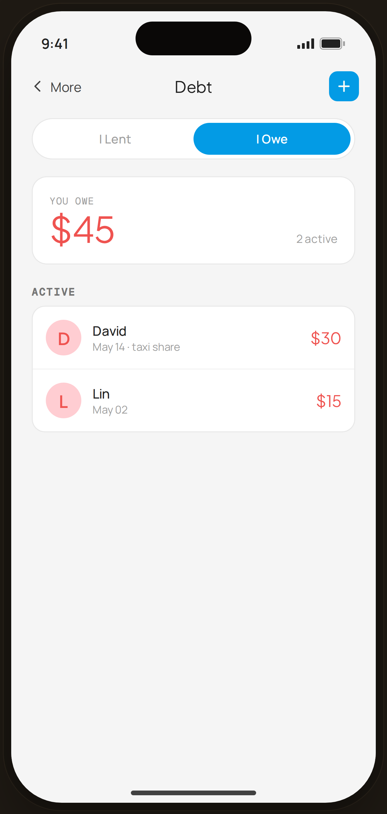

# Debt · I Owe — Flow 07 · Debt & Lending

`debt-owe` · artboard 414×868

## Purpose
The debt tracker, "I Owe" view (`<ScreenDebtTrackerHi view="owe" />`): money the user owes others. Mirror of the lent view with red semantics.

## Layout (top → bottom)
- Phone chrome.
- **NavBar** — back "‹ More", center "Debt", right blue ＋ tile.
- Scroll body:
  - **I Lent / I Owe** segmented toggle (I Owe active, blue).
  - **Summary card** — mono "YOU OWE"; serif 38px total (red) + "2 active".
  - **Active** list — 2 rows: initial avatar (red tint) · name · date·note · serif amount (red).
  - (No Settled section in the owe view.)

## Components & content
- Active (owe): David $30 (May 14 · taxi share), Lin $15 (May 02). Total owed = $45.
- Copy: `Debt`, `I Lent`, `I Owe`, `YOU OWE`, `2 active`, `Active`.

## Typography & color
- Owe accent `--danger` #ef5350 (amounts + avatar tint `--danger-tint`); "I Owe" toggle fill `--blue-500`.

## States & interactions
- `view="owe"`: red semantics. Settled section is omitted (only rendered for lent). Toggle switches to `debt-lent`. Rows tap → `debt-owe-detail`.

## Implementation notes
- Same component as `debt-lent`, `view="owe"`. `owe[]` array local. Reuses `PhoneShell`, `NavBar`, `BackBtn`, `SectionTitle`, `Icon`, `currencyFmt`, `Toggle`.
