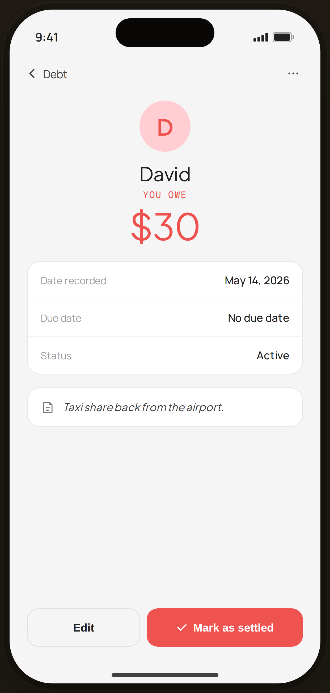

# Debt Detail · Owe · David — Flow 07 · Debt & Lending

`debt-owe-detail` · artboard 414×868

## Purpose
Detail of an owed record (`<ScreenDebtDetailHi view="owe" />`): who the user owes, how much, and settle/edit actions. Red-accented mirror of the lent detail, with no linked expense.

## Layout (top → bottom)
- Phone chrome.
- **NavBar** — back "‹ Debt", right "⋯".
- Scroll body:
  - **Hero** — 64px red-tint "D" avatar; serif "David"; mono "YOU OWE" (red); serif 46px "$30" (red).
  - **Fields** card — Date recorded May 14, 2026 · Due date "No due date" · Status Active.
  - **Note** card — serif italic "Taxi share back from the airport."
  - (No linked-expense card — `rec.linked` is null for owe.)
- **Actions** — "Edit" (outline) + "✓ Mark as settled" (red fill, wider).

## Components & content
- Copy: `David`, `YOU OWE`, `$30`, `Date recorded` `May 14, 2026`, `Due date` `No due date`, `Status` `Active`, note, `Edit`, `Mark as settled`.

## Typography & color
- Avatar/amount accent `--danger` #ef5350 on `--danger-tint`.
- Settle button uses the red accent fill (matches the owe semantics), white text.

## States & interactions
- `view="owe"`: red accent; no linked expense section. "Mark as settled" confirms repayment.

## Implementation notes
- Same component as `debt-lent-detail`, `view="owe"` selects the David `rec`. Reuses `PhoneShell`, `NavBar`, `BackBtn`, `Icon`, `currencyFmt`.
