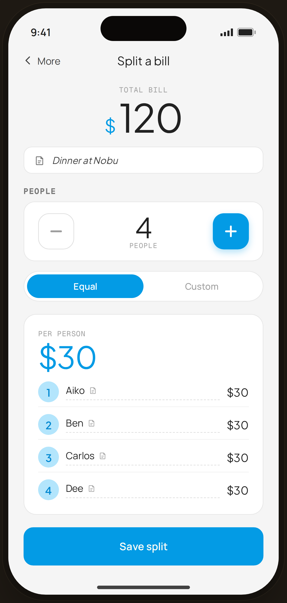

# Split a bill · equal — Flow 08 · Shared Costs

`shared-input` · artboard 414×868

## Purpose
The bill-split input screen (`<ScreenSharedCostsHi />`): enter a total, set the number of people, choose equal/custom, and preview each person's share.

## Layout (top → bottom)
- Phone chrome.
- **NavBar** — back "‹ More", center "Split a bill".
- Scroll body:
  - **Total bill** (centered) — mono label; serif "$120" (blue "$").
  - **Note** chip — serif italic "Dinner at Nobu".
  - **People** stepper — large minus (outline) / serif "4 people" / blue plus (raised).
  - **Equal / Custom** segmented toggle (Equal active).
  - **Per person** card — mono "PER PERSON"; serif 44px "$30" (blue); 4 editable name rows (numbered avatar · name · "$30").
  - **Save split** primary button.

## Components & content
- Copy: `Split a bill`, `Total bill`, `$120`, `Dinner at Nobu`, `People`, `4`, `Equal`, `Custom`, `PER PERSON`, `$30`, names `Aiko/Ben/Carlos/Dee`, `Save split`.

## Typography & color
- Total/per-person `--serif`; per-person figure `--blue-500` #039be5.
- Plus stepper `--clay` with blue glow; minus outlined. Equal toggle fill `--blue-500`.

## States & interactions
- Equal mode → each share = total/people ($30). Stepper adjusts count; names editable (dashed underline + pencil). Save → summary (`shared-summary`). $0 and max-20/custom edge states: `edge-shared-zero`, `edge-shared-limits`.

## Implementation notes
- `people=4`, `total=120` hard-coded; `perPerson` computed. Reuses `PhoneShell`, `NavBar`, `BackBtn`, `SectionTitle`, `Button`, `Icon`, `Toggle`.
