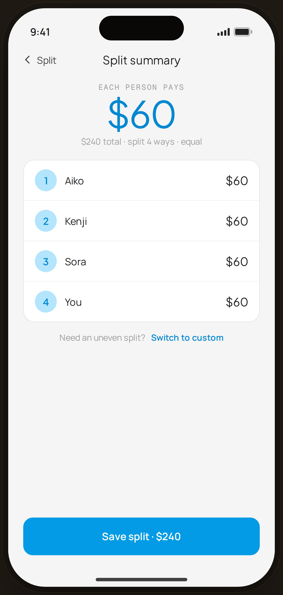

# Split summary — Flow 08 · Shared Costs

`shared-summary` · artboard 414×868

## Purpose
The confirmation step after entering a split (`<SharedSplitSummary />`): shows the per-person amount and roster before saving.

## Layout (top → bottom)
- Phone chrome.
- **NavBar** — back "‹ Split", center "Split summary".
- Scroll body:
  - **Hero** (centered) — mono "EACH PERSON PAYS"; serif 54px "$60" (blue-700); caption "$240 total · split 4 ways · equal".
  - **Per-person rows** card — 4 rows (numbered avatar · name · serif "$60").
  - Helper row — "Need an uneven split?  Switch to custom" (blue link).
- **Bottom CTA**: primary "Save split · $240", full-width.

## Components & content
- Copy: `Split summary`, `EACH PERSON PAYS`, `$60`, `$240 total · split 4 ways · equal`, names `Aiko/Kenji/Sora/You`, `Need an uneven split?`, `Switch to custom`, `Save split · $240`.

## Typography & color
- Hero amount `--serif` 54px -0.025em `--blue-700` #0288d1; rows `--sans` + serif amounts.
- "Switch to custom" link `--blue-700` 600.

## States & interactions
- Read-back of the equal split (4 × $60 = $240). "Switch to custom" returns to an uneven-split editor. Save persists to history (`shared-history`).

## Implementation notes
- `people[]`, `per=60` hard-coded. Reuses `PhoneShell`, `NavBar`, `BackBtn`, `Button`, `currencyFmt`.
