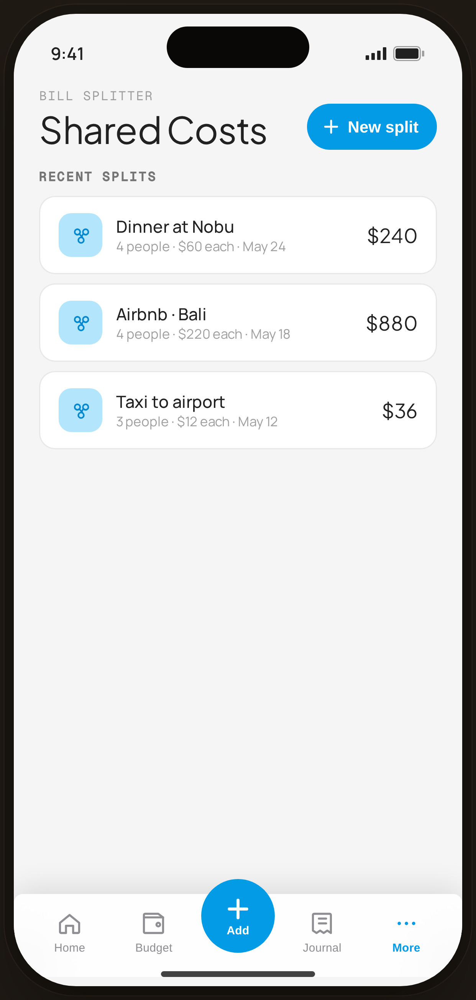

# Shared Costs · history — Flow 08 · Shared Costs

`shared-history` · artboard 414×868

## Purpose
Where saved splits land (`<SharedHistory />`): a list of past bill splits with totals and per-person info.

## Layout (top → bottom)
- Phone chrome.
- **Header** (14×22): mono "BILL SPLITTER"; serif 32px "Shared Costs" with a blue pill "＋ New split" on the right.
- Scroll body: `SectionTitle` "RECENT SPLITS"; a list of split cards — blue-tint split icon · note · "N people · $X each · date" · serif total.
- **Floating bottom nav** (`active="more"`).

## Components & content
- Splits: Dinner at Nobu — 4 people · $60 each · May 24 · $240; Airbnb · Bali — 4 people · $220 each · May 18 · $880; Taxi to airport — 3 people · $12 each · May 12 · $36.
- Copy: `BILL SPLITTER`, `Shared Costs`, `New split`, `Recent splits`.

## Typography & color
- Title `--serif` 32px; totals `--serif` 17px; meta `--muted`.
- "New split" pill `--blue-500` #039be5 with white text; split icons blue-700 on blue-100.

## States & interactions
- List of saved splits; "New split" starts the input flow (`shared-input`). Rows tap into a saved split's detail/summary.

## Implementation notes
- `items[]` array local; per-person derived (`total/n`). Reuses `PhoneShell`, `SectionTitle`, `ProtoBottomNav`, `Icon`, `currencyFmt`.
