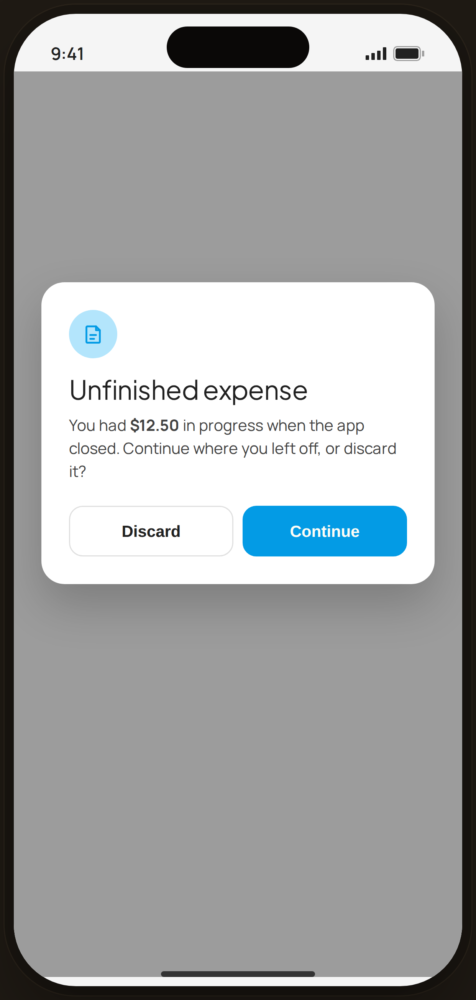

# Draft restore — Edge Case

`edge-draft` · Flow 01 · Quick Log · artboard 414×868

## Purpose
On relaunch, an unfinished expense draft is detected (`<EdgeDraftRestore />`). A dialog offers to continue or discard it — preventing silent data loss.

## Layout (top → bottom)
- Phone chrome (plain paper behind).
- **Center dialog** (`EdgeDialog`, blue tone) over scrim: blue note-icon chip; serif 23px title "Unfinished expense"; body "You had **$12.50** in progress when the app closed. Continue where you left off, or discard it?"; action row "Discard" (secondary) + "Continue" (primary blue).

## Components & content
- Copy: `Unfinished expense`, `You had $12.50 in progress when the app closed. Continue where you left off, or discard it?`, `Discard`, `Continue`.

## Typography & color
- Title `--serif` 23px; body `--ink-2`.
- Tone blue: icon chip `--blue-100` / `--blue-500`; primary "Continue" `--clay` #039be5.

## States & interactions
- Modal dialog over `rgba(33,33,33,0.42)` scrim. Continue restores the draft into Add Expense; Discard drops it.

## Implementation notes
- `EdgeDialog` with `tone="blue"`, `icon="note"`. Static. Reuses `PhoneShell`. Buttons use local `btnSecondary`/`btnPrimary`.
