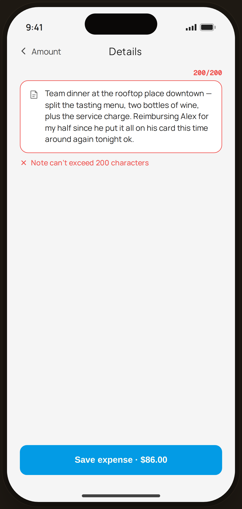

# Note at 200 cap — Edge Case

`edge-note` · Flow 01 · Quick Log · artboard 414×868

## Purpose
The note field at its 200-character limit (`<EdgeNoteCap />`). Shows the hard cap with a red counter and inline error.

## Layout (top → bottom)
- Phone chrome.
- **NavBar** — back "‹ Amount", center "Details".
- Body: right-aligned red "200/200" counter; a red-outlined note field containing the full 200-char note; an `InlineError` "Note can't exceed 200 characters".
- **Bottom CTA**: primary "Save expense · $86.00".

## Components & content
- Copy: `Details`, `200/200`, the capped note text, `Note can't exceed 200 characters`, `Save expense · $86.00`.

## Typography & color
- Counter `--mono` 11.5px `--danger` #ef5350 600; field border `--danger`.
- `InlineError`: close icon + `--danger` text.

## States & interactions
- Input blocked beyond 200 chars; counter and border turn red, error shows. Save remains available (the note is valid at exactly 200).

## Implementation notes
- `note` string is exactly 200 chars. Reuses `PhoneShell`, `NavBar`, `BackBtn`, `InlineError`, `Icon`, local `btnPrimaryFull`.
