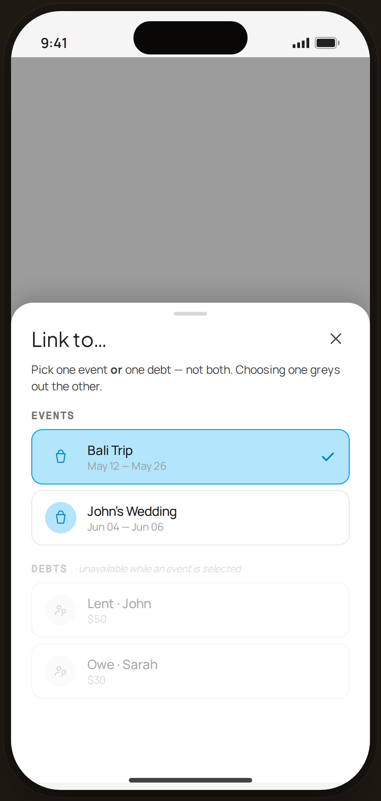

# @ tag mutual-exclusion — Edge Case

`edge-tag` · Flow 01 · Quick Log · artboard 414×868

## Purpose
The "Link to…" tag picker enforcing one-of rule (`<EdgeTagExclusion />`): picking an event greys out debts (and vice versa).

## Layout (top → bottom)
- Phone chrome (plain paper behind).
- **Bottom sheet** (`EdgeBottomSheet`, height 520) over scrim:
  - Title "Link to…"; explainer "Pick one event **or** one debt — not both. Choosing one greys out the other."
  - **Events** section — Bali Trip (selected, blue, check), John's Wedding.
  - **Debts** section — dimmed to 38% with italic note "· unavailable while an event is selected"; Lent · John ($50), Owe · Sarah ($30).

## Components & content
- Copy: `Link to…`, the explainer, `Events`, `Bali Trip` / `May 12 — May 26`, `John's Wedding` / `Jun 04 — Jun 06`, `Debts`, `· unavailable while an event is selected`, `Lent · John` / `$50`, `Owe · Sarah` / `$30`.

## Typography & color
- Selected event row: `--blue-100` bg, `--blue-500` border, blue-700 check.
- Disabled debts block: `opacity: 0.38`, `pointer-events: none`.

## States & interactions
- Event selected → debts disabled. Choosing a debt instead would disable events. One link max per expense.

## Implementation notes
- `EdgeBottomSheet` + local `PickRow`s. Static. Reuses `PhoneShell`, `SectionTitle`, `Icon`.
