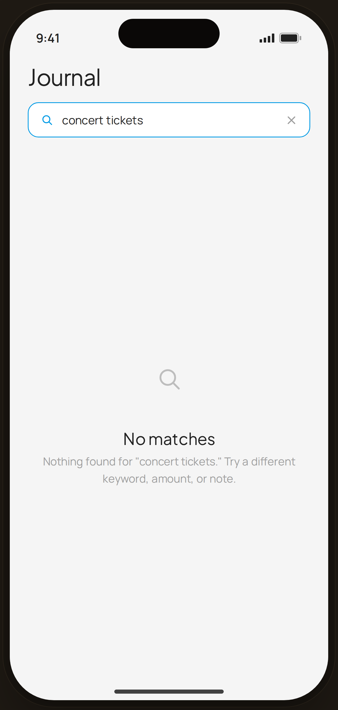

# Journal · no results — Edge Case

`edge-search` · Flow 02 · Browse Journal · artboard 414×868

## Purpose
Journal search with an active query that matches nothing (`<EdgeJournalNoResults />`). Empty-results state.

## Layout (top → bottom)
- Phone chrome.
- **Header** — serif 28px "Journal"; an active, blue-outlined search field showing "concert tickets" with a clear (✕) icon.
- **Empty block** (flex-1, centered): 84px gray circle with a search icon; serif 20px "No matches"; body "Nothing found for \"concert tickets.\" Try a different keyword, amount, or note."

## Components & content
- Copy: `Journal`, query `concert tickets`, `No matches`, `Nothing found for "concert tickets." Try a different keyword, amount, or note.`

## Typography & color
- Empty title `--serif` 20px; body `--muted`.
- Active search field border `--blue-500` #039be5; placeholder icon muted-2.

## States & interactions
- Query entered, zero matches. Clearing (✕) returns to the full list. Guides the user to retry with different terms.

## Implementation notes
- Static. Reuses `PhoneShell`, `Icon`. Distinct from the populated `journal-list`.
