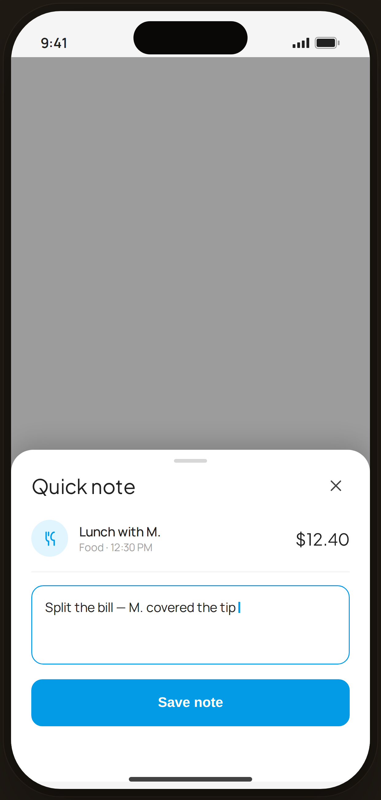

# Long-press quick note — Edge Case

`edge-quicknote` · Flow 02 · Browse Journal · artboard 414×868

## Purpose
A long-press on a journal row opens a quick-note sheet (`<EdgeQuickNote />`) to annotate an expense without full edit.

## Layout (top → bottom)
- Phone chrome (plain paper behind).
- **Bottom sheet** (`EdgeBottomSheet`, height 360) over scrim:
  - Title "Quick note".
  - **Expense header row** — CatBadge (food) · "Lunch with M." / "Food · 12:30 PM" · serif "$12.40".
  - **Note textarea** — blue-outlined, content "Split the bill — M. covered the tip" with caret.
  - **Save note** primary button.

## Components & content
- Copy: `Quick note`, `Lunch with M.`, `Food · 12:30 PM`, `$12.40`, note `Split the bill — M. covered the tip`, `Save note`.

## Typography & color
- Sheet title `--serif` 22px; note field border `--blue-500` #039be5.
- Save button `--clay` (local `btnPrimaryFull`).

## States & interactions
- Triggered by long-press gesture; quick inline note edit over a scrim. Save persists the note to that expense.

## Implementation notes
- `EdgeBottomSheet` + `CatBadge`. Caret is `proto-cursor`. Static. Reuses `PhoneShell`.
