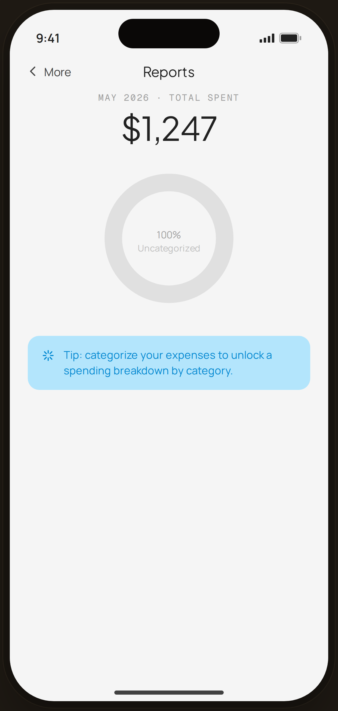

# Reports · all uncategorized — Edge Case

`edge-reports-unc` · Flow 03 · More (Reports) · artboard 414×868

## Purpose
Reports when every expense is uncategorized (`<EdgeReportsUncategorized />`). The donut can't break down by category, so it shows a single full ring + a tip.

## Layout (top → bottom)
- Phone chrome.
- **NavBar** — back "‹ More", center "Reports".
- Body (centered): mono "MAY 2026 · TOTAL SPENT"; serif 40px "$1,247"; a 180px single-color donut (full ring) with center "100% / Uncategorized"; a blue tip card.

## Components & content
- Copy: `Reports`, `MAY 2026 · TOTAL SPENT`, `$1,247`, `100%`, `Uncategorized`, tip `Tip: categorize your expenses to unlock a spending breakdown by category.`

## Typography & color
- Total `--serif` 40px; donut ring `--gray-300` (no segments).
- Tip card `--blue-100` bg with `--blue-700` text + sparkle icon.

## States & interactions
- Degenerate report state: 100% uncategorized → no category breakdown; nudges the user to categorize.

## Implementation notes
- Single full-circle ring (no dash math). Static. Reuses `PhoneShell`, `NavBar`, `BackBtn`, `Icon`.
