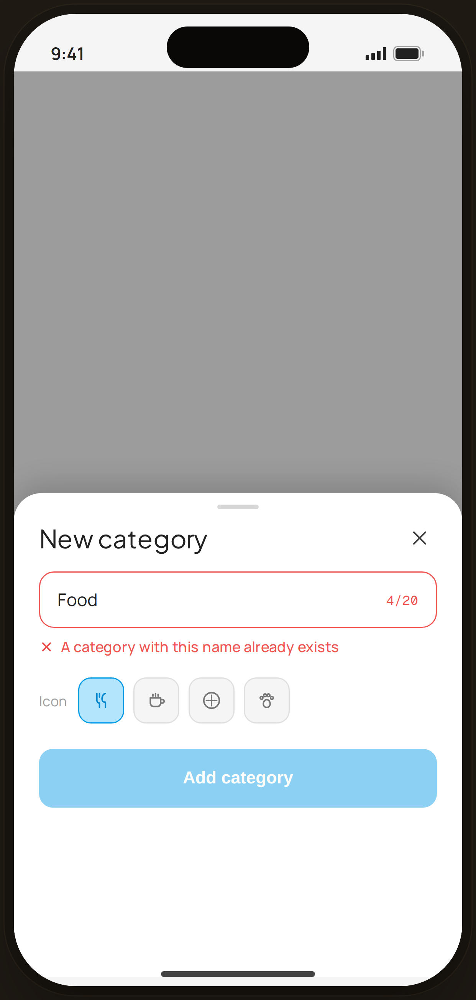

# Category · duplicate name — Edge Case

`edge-cat-dup` · Flow 03 · More (Categories) · artboard 414×868

## Purpose
Creating a category whose name already exists (`<EdgeCategoryDuplicate />`). Inline validation blocks the save.

## Layout (top → bottom)
- Phone chrome (plain paper behind).
- **Bottom sheet** (`EdgeBottomSheet`, height 420) over scrim:
  - Title "New category".
  - **Name field** (error) — "Food" with red "4/20" counter; `InlineError` "A category with this name already exists".
  - **Icon** picker — "Icon" label + 4 icon tiles (first selected, blue).
  - **Add category** button, **disabled** (opacity 0.45).

## Components & content
- Copy: `New category`, `Food`, `4/20`, `A category with this name already exists`, `Icon`, `Add category`.

## Typography & color
- Error field border `--danger` #ef5350; counter danger; `InlineError` danger.
- Selected icon tile `--blue-100` / `--blue-500` border. Disabled CTA dimmed.

## States & interactions
- Duplicate name → field error + disabled "Add category" until the name is unique.

## Implementation notes
- `EdgeBottomSheet` + `Field error` + `InlineError`. Static. Reuses `PhoneShell`, `Icon`, local `btnPrimaryFull`.
