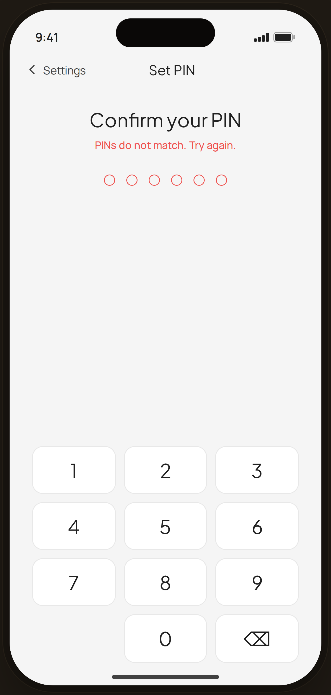

# PIN · mismatch — Edge Case

`edge-pin-mismatch` · Flow 05 · PIN Auth · artboard 414×868

## Purpose
During PIN setup, the confirmation PIN doesn't match the first entry (`<EdgePinMismatch />`). Error + shake, re-enter.

## Layout (top → bottom)
- Phone chrome.
- **NavBar** — back "‹ Settings", center "Set PIN".
- Center: serif 24px "Confirm your PIN"; red helper "PINs do not match. Try again."; 6 empty dots with **red** outlines (shake animation); numeric keypad (`NumPad`) at the bottom.

## Components & content
- Copy: `Set PIN`, `Confirm your PIN`, `PINs do not match. Try again.`, digits 0–9.

## Typography & color
- Title `--serif` 24px; helper `--danger` #ef5350 500.
- Dots: transparent fill, 1.6px `--danger` outline; `proto-shake` applied.

## States & interactions
- Mismatch resets the confirm field (dots cleared) with shake + red messaging; user re-enters the confirmation.

## Implementation notes
- Local `NumPad`. Shake frozen in capture. Static. Reuses `PhoneShell`, `NavBar`, `BackBtn`.
