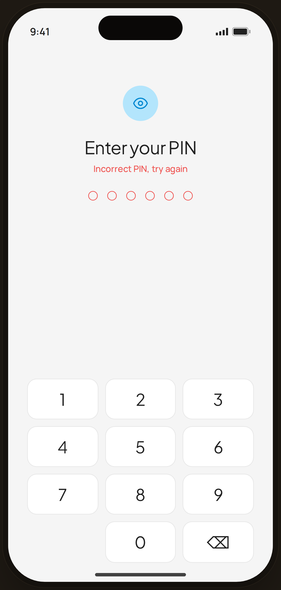

# PIN · incorrect — Edge Case

`edge-pin-wrong` · Flow 05 · PIN Auth · artboard 414×868

## Purpose
A wrong PIN on the unlock screen (`<EdgePinWrong />`). Error + shake feedback before lockout.

## Layout (top → bottom)
- Phone chrome.
- Center stack: 52px blue-tint chip with eye icon; serif 26px "Enter your PIN"; red helper "Incorrect PIN, try again"; 6 empty **red-outlined** dots (shake); numeric keypad (`NumPad`) at bottom.

## Components & content
- Copy: `Enter your PIN`, `Incorrect PIN, try again`, digits 0–9.

## Typography & color
- Title `--serif` 26px; helper `--danger` #ef5350 500; dots red outline; `proto-shake`.

## States & interactions
- Wrong entry → dots clear with shake + red message. Repeated failures lead to the lockout state (`pin-lock`).

## Implementation notes
- Local `NumPad`. Static. Reuses `PhoneShell`, `Icon`.
