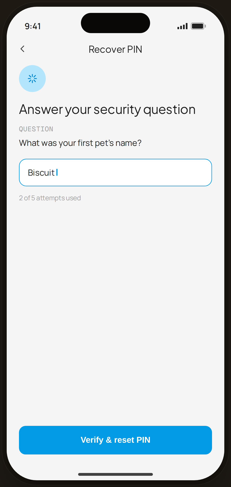

# PIN · recovery — Edge Case

`edge-pin-recovery` · Flow 05 · PIN Auth · artboard 414×868

## Purpose
PIN recovery via the security question (`<EdgePinRecovery />`), reached from "Forgot PIN?". Answer correctly to reset the PIN.

## Layout (top → bottom)
- Phone chrome.
- **NavBar** — back, center "Recover PIN".
- Body: 48px blue-tint chip with sparkle icon; serif 23px "Answer your security question"; mono "QUESTION" label + "What was your first pet's name?"; a blue-outlined answer field "Biscuit" with caret; helper "2 of 5 attempts used".
- **Bottom CTA**: primary "Verify & reset PIN".

## Components & content
- Copy: `Recover PIN`, `Answer your security question`, `QUESTION`, `What was your first pet's name?`, answer `Biscuit`, `2 of 5 attempts used`, `Verify & reset PIN`.

## Typography & color
- Title `--serif` 23px; answer field border `--blue-500` #039be5; attempts helper `--muted`.

## States & interactions
- Limited to 5 attempts (2 used shown). Correct answer → reset PIN; exhausting attempts blocks recovery.

## Implementation notes
- Static. Reuses `PhoneShell`, `NavBar`, `BackBtn`, `Icon`, local `btnPrimaryFull`. Caret is `proto-cursor`.
