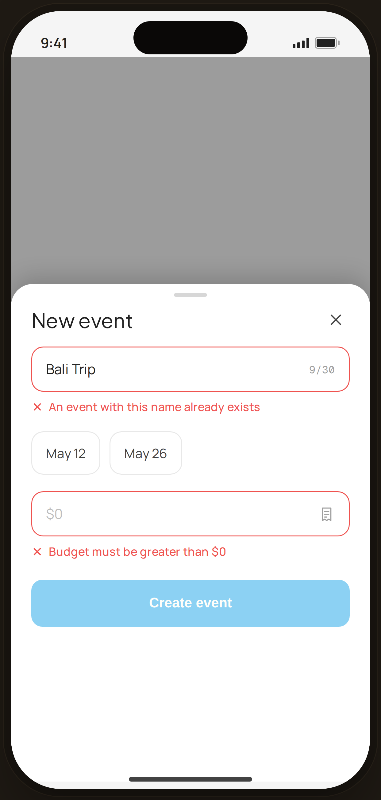

# Event · $0 + duplicate — Edge Case

`edge-event-errors` · Flow 06 · Event Budget · artboard 414×868

## Purpose
The create-event sheet with two simultaneous validation errors (`<EdgeEventErrors />`): a duplicate name and a $0 budget. Save is blocked.

## Layout (top → bottom)
- Phone chrome (plain paper behind).
- **Bottom sheet** (`EdgeBottomSheet`, height 540) over scrim, title "New event":
  - **Name field** (error) — "Bali Trip" + "9/30"; `InlineError` "An event with this name already exists".
  - **Dates** — May 12 / May 26 (valid).
  - **Budget field** (error) — "$0" (muted); `InlineError` "Budget must be greater than $0".
  - **Create event** button **disabled** (opacity 0.45).

## Components & content
- Copy: `New event`, `Bali Trip`, `9/30`, `An event with this name already exists`, `May 12`, `May 26`, `$0`, `Budget must be greater than $0`, `Create event`.

## Typography & color
- Error fields border `--danger` #ef5350; `InlineError` danger; $0 value `--muted-2`.
- Disabled CTA dimmed.

## States & interactions
- Two blocking errors → CTA disabled until name is unique and budget > $0.

## Implementation notes
- Two `Field error` + `InlineError`. Static. Reuses `PhoneShell`, `EdgeBottomSheet`, `Icon`, local `btnPrimaryFull`.
