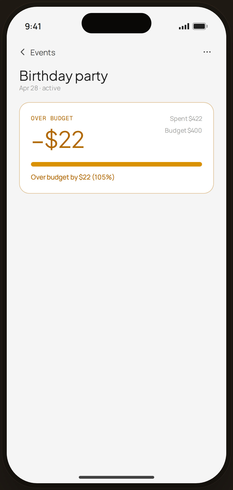

# Event · over budget (105%) — Edge Case

`edge-event-warn` · Flow 06 · Event Budget · artboard 414×868

## Purpose
An event detail that has exceeded its budget (`<EdgeEventWarning />`), shown in the amber 100–110% warning band.

## Layout (top → bottom)
- Phone chrome.
- **NavBar** — back "‹ Events", right "⋯".
- Body: serif 24px "Birthday party"; "Apr 28 · active"; an amber-bordered hero card — mono "OVER BUDGET" + serif 40px "−$22" (amber); right column Spent $422 / Budget $400; a full amber progress bar; footer "Over budget by $22 (105%)".

## Components & content
- Copy: `Birthday party`, `Apr 28 · active`, `OVER BUDGET`, `−$22`, `Spent $422`, `Budget $400`, `Over budget by $22 (105%)`.

## Typography & color
- Warning amber `#b26a00` (text/label) and `#d99100` (bar fill); card border `rgba(178,106,0,0.4)`.
- Amount `--serif` 40px amber.

## States & interactions
- 100–110% over-budget warning tier (amber) — distinct from the on-track (blue) and the hard over-budget red list pill. Bar clamps at 100%.

## Implementation notes
- Amber tones are literal hex (not core tokens). Static. Reuses `PhoneShell`, `NavBar`, `BackBtn`, `Icon`.
