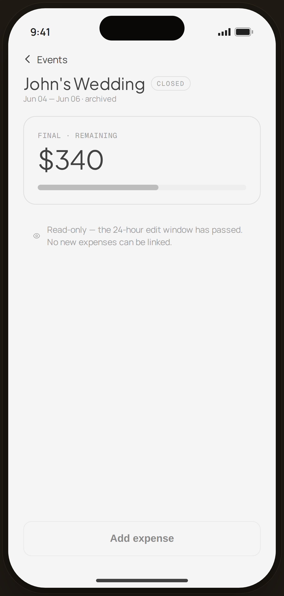

# Event · closed (read-only) — Edge Case

`edge-event-closed` · Flow 06 · Event Budget · artboard 414×868

## Purpose
An archived/closed event detail (`<EdgeEventClosed />`): read-only, no new expenses can be linked once the edit window passes.

## Layout (top → bottom)
- Phone chrome.
- **NavBar** — back "‹ Events".
- Body: serif 24px "John's Wedding" (muted) + a "CLOSED" pill; "Jun 04 — Jun 06 · archived"; a muted/gray hero card — mono "FINAL · REMAINING" + serif 38px "$340"; a gray progress bar (58%); an info row explaining read-only.
- **Bottom CTA**: secondary "Add expense" **disabled** (opacity 0.5).

## Components & content
- Copy: `John's Wedding`, `Closed`, `Jun 04 — Jun 06 · archived`, `FINAL · REMAINING`, `$340`, `Read-only — the 24-hour edit window has passed. No new expenses can be linked.`, `Add expense`.

## Typography & color
- Everything desaturated: title `--ink-2`, card `--gray-100`, bar fill `--muted-2`.
- "Closed" pill: mono, `--line-strong` border, `--muted`.

## States & interactions
- Read-only archived state: figures locked, "Add expense" disabled, info row explains the closed 24-hour edit window.

## Implementation notes
- Static. Reuses `PhoneShell`, `NavBar`, `BackBtn`, `Icon`, local `btnSecondaryFull`.
