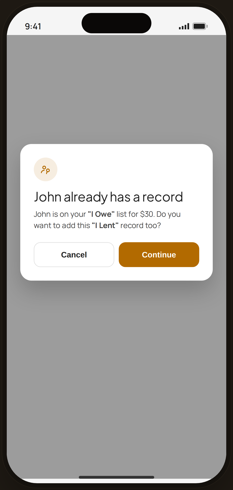

# Debt · opposite-side warning — Edge Case

`edge-debt-conflict` · Flow 07 · Debt & Lending · artboard 414×868

## Purpose
Adding a debt for a person who already has a record on the opposite side (`<EdgeDebtConflict />`). A soft amber warning lets the user proceed deliberately.

## Layout (top → bottom)
- Phone chrome (plain paper behind).
- **Center dialog** (`EdgeDialog`, warn tone) over scrim: amber debt-icon chip; serif 23px "John already has a record"; body "John is on your **\"I Owe\"** list for $30. Do you want to add this **\"I Lent\"** record too?"; action row "Cancel" (secondary) + "Continue" (amber primary).

## Components & content
- Copy: `John already has a record`, `John is on your "I Owe" list for $30. Do you want to add this "I Lent" record too?`, `Cancel`, `Continue`.

## Typography & color
- Warn tone: icon chip `rgba(178,106,0,0.12)` / `#b26a00`; "Continue" button `#b26a00`.

## States & interactions
- Non-blocking warning (not an error): Cancel aborts; Continue creates the opposite-side record anyway.

## Implementation notes
- `EdgeDialog tone="warn" icon="feat-debt"`. Static. Reuses `PhoneShell`, local `btnSecondary`/`btnPrimary`.
