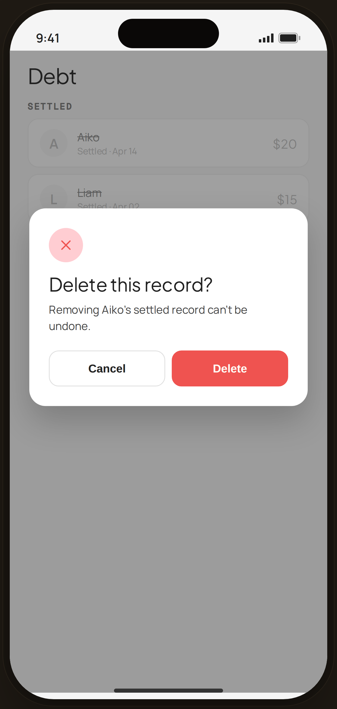

# Debt · delete settled — Edge Case

`edge-debt-settled` · Flow 07 · Debt & Lending · artboard 414×868

## Purpose
Deleting a settled debt record (`<EdgeDebtSettled />`). A destructive confirm over the Settled list.

## Layout (top → bottom)
- Phone chrome with content behind: serif 26px "Debt"; `SectionTitle` "SETTLED"; two faded settled rows (strikethrough names) — Aiko $20 (Apr 14), Liam $15 (Apr 02).
- **Center dialog** (`EdgeDialog`, danger tone) over scrim: red close-icon chip; serif 23px "Delete this record?"; body "Removing Aiko's settled record can't be undone."; action row "Cancel" (secondary) + "Delete" (red primary).

## Components & content
- Copy: `Debt`, `SETTLED`, settled rows, `Delete this record?`, `Removing Aiko's settled record can't be undone.`, `Cancel`, `Delete`.

## Typography & color
- Settled rows faded (opacity 0.6) with line-through names.
- Danger tone: icon chip `--danger-tint` / `--danger`; "Delete" button `--danger` #ef5350.

## States & interactions
- Irreversible delete confirm; Cancel keeps the record, Delete removes it permanently.

## Implementation notes
- `EdgeDialog tone="danger" icon="close"`. Static. Reuses `PhoneShell`, `SectionTitle`, local button styles.
