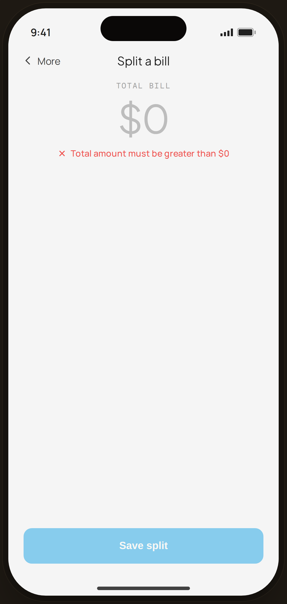

# Shared · $0 total — Edge Case

`edge-shared-zero` · Flow 08 · Shared Costs · artboard 414×868

## Purpose
The bill-split screen with a $0 total (`<EdgeSharedZero />`). Save is blocked until a positive amount is entered.

## Layout (top → bottom)
- Phone chrome.
- **NavBar** — back "‹ More", center "Split a bill".
- Body (centered): mono "TOTAL BILL"; serif 56px "$0" (muted); `InlineError` "Total amount must be greater than $0".
- **Bottom CTA**: primary "Save split" **disabled** (opacity 0.45).

## Components & content
- Copy: `Split a bill`, `TOTAL BILL`, `$0`, `Total amount must be greater than $0`, `Save split`.

## Typography & color
- Total `--serif` 56px `--muted-2`; `InlineError` `--danger` #ef5350.
- Disabled CTA dimmed.

## States & interactions
- $0 total → error + disabled Save. Entering a positive total clears it (mirrors the Add-Expense $0 guard).

## Implementation notes
- Static. Reuses `PhoneShell`, `NavBar`, `BackBtn`, `InlineError`, local `btnPrimaryFull`.
