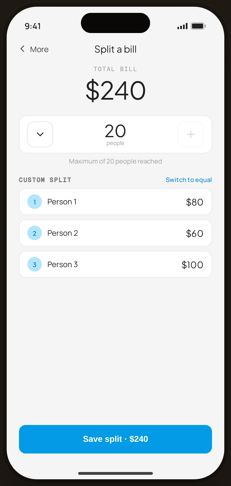

# Shared · max 20 + custom — Edge Case

`edge-shared-limits` · Flow 08 · Shared Costs · artboard 414×868

## Purpose
The bill-split at its participant ceiling with a custom (uneven) split (`<EdgeSharedLimits />`). Demonstrates the 20-person cap and per-person custom amounts.

## Layout (top → bottom)
- Phone chrome.
- **NavBar** — back "‹ More", center "Split a bill".
- Body: centered mono "TOTAL BILL" + serif 44px "$240"; a **stepper at max** — enabled minus / serif "20 people" / **disabled** plus (opacity 0.4) — with caption "Maximum of 20 people reached"; a "Custom split" header with "Switch to equal" link; custom rows (Person 1 $80, Person 2 $60, Person 3 $100).
- **Bottom CTA**: primary "Save split · $240" (enabled).

## Components & content
- Copy: `Split a bill`, `TOTAL BILL`, `$240`, `20`, `Maximum of 20 people reached`, `Custom split`, `Switch to equal`, rows `Person 1 $80` / `Person 2 $60` / `Person 3 $100`, `Save split · $240`.

## Typography & color
- Total/per-person `--serif`; cap caption `--muted`; "Switch to equal" `--blue-700` 500.
- Disabled plus stepper dimmed (opacity 0.4).

## States & interactions
- People count capped at 20 (plus disabled). Custom mode allows uneven per-person amounts. Save enabled with a valid total.

## Implementation notes
- Static; custom rows hard-coded. Reuses `PhoneShell`, `NavBar`, `BackBtn`, `SectionTitle`, `Icon`, local `btnPrimaryFull`.
