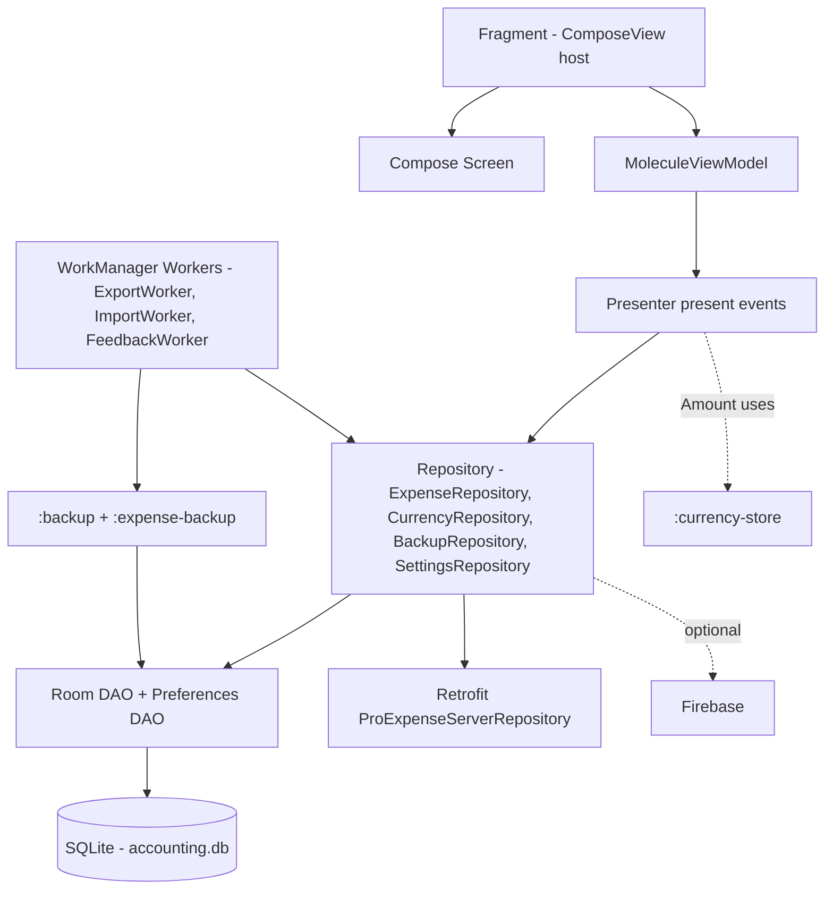
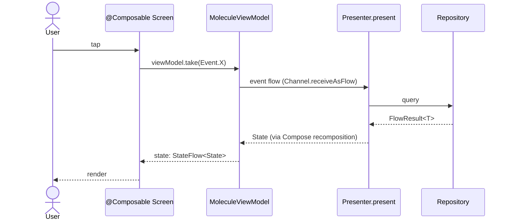
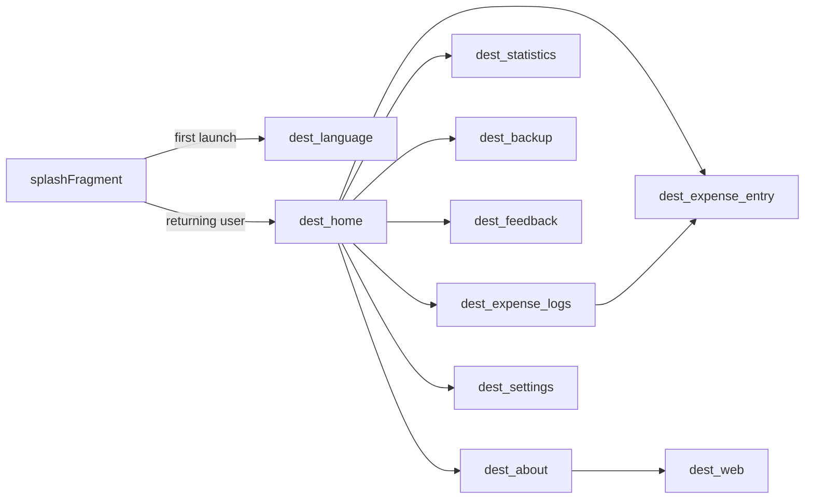

# ProExpense — Architecture Overview

This document describes the overall architecture of the ProExpense Android app. It is intended as the entry-point for new contributors and complements per-screen docs (`Home.md`, `Statistic.md`, `ExpenseLogs.md`, …) and `CLAUDE.md`.

## 1. App Profile

| Item | Value |
|---|---|
| Package | `com.arduia.expense` (prod) / `com.arduia.expense.dev` (dev) |
| Min SDK / Target SDK | See `gradle/libs.versions.toml` |
| Build flavors | `dev`, `production` |
| Language | Kotlin, JVM target 17 |
| UI | Jetpack Compose (Material 3) — mid-migration from XML/ViewBinding |
| State engine | Cash App **Molecule** (Compose-runtime presenters) |
| DI | Hilt |
| Persistence | Room (database name `accounting.db`) |
| Async | Kotlin Coroutines + Flow |
| Background work | WorkManager (with Hilt worker factory) |
| Network | Retrofit + Gson |
| Backend | Firebase (Analytics, Crashlytics, Remote Config, Firestore) |
| Backup | Excel (jxl) via the `:backup` / `:expense-backup` modules |

## 2. Module Graph

```mermaid
graph TD
    app[:app]
    ds[:design-system]
    shared[:shared]
    backup[:backup]
    expBackup[:expense-backup]
    currency[:currency-store]
    graph[:week-expense-graph]

    app --> ds
    app --> shared
    app --> backup
    app --> expBackup
    app --> currency
    app --> graph
    expBackup --> backup
```

| Module | Responsibility |
|---|---|
| `:app` | All UI (Fragments + Compose screens), ViewModels, Presenters, Hilt modules, Room DB, repositories. |
| `:design-system` | `ProExpenseTheme`, color/typography/shape tokens, reusable Compose components (`ProExpenseButton`, `ProExpenseTextField`, `ProExpenseCard`, `ProExpenseSearchField`). Imports under `com.arduia.design.*`. |
| `:shared` | Cross-cutting utilities — `core/arch/Mapper`, locale switching (`LocaleUpdate`), unit/extension helpers. |
| `:backup` | Generic Excel (jxl) backup engine: `BackupSheet`, `BackupSource`, `BackupTask`, `BackupResult`. Stateless / framework-agnostic. |
| `:expense-backup` | ProExpense-specific schema on top of `:backup` — `MainCategoryField`, `Metadata`, table/field schema. |
| `:currency-store` | `Store<A, S>` and `Rate<S>` abstractions used by the domain `Amount` type. Implements the *store value vs. actual value* split (decimals stored as integers). |
| `:week-expense-graph` | Custom Android `View` (`SpendGraph`) for the weekly spend graph on Home. View-based, not Compose. |

## 3. High-Level Layering



The conceptual layers are:

1. **UI** — Fragment (hosts `ComposeView`) → Compose screen → calls `viewModel.take(event)`.
2. **State** — `MoleculeViewModel` → `Presenter.present(events)` runs in the Compose runtime, returns a `State` data class.
3. **Data** — Repositories wrap DAOs (Room) and remote services (Retrofit). All emissions are wrapped in `Result<T>` (alias `FlowResult<T> = Flow<Result<T>>`).
4. **Background** — WorkManager workers (`ExportWorker`, `ImportWorker`, `FeedbackWorker`) coordinated with the `BackupRepository`.

## 4. MVVM + Molecule Presenter Pattern

Each feature has three classes in the same package, plus a `molecule/` sub-package:

```
ui/<feature>/
├── <Feature>Fragment.kt              # hosts a ComposeView, side-effects only
├── <Feature>ViewModel.kt             # MoleculeViewModel<Event, State>
├── <Feature>Screen.kt (compose/)     # pure @Composable, takes state + callbacks
└── molecule/
    ├── <Feature>Event.kt             # sealed interface
    ├── <Feature>State.kt             # data class
    └── <Feature>Presenter.kt         # implements Presenter<Event, State>
```

### Event/State contract



Core abstractions:

```kotlin
interface Presenter<Event, State> {
    @Composable
    fun present(events: Flow<Event>): State
}

abstract class MoleculeViewModel<Event, State> : ViewModel() {
    private val events = Channel<Event>(Channel.UNLIMITED)
    val state: StateFlow<State> by lazy {
        viewModelScope.launchMolecule(RecompositionMode.Immediate) {
            present(events.receiveAsFlow())
        }
    }
    protected abstract val presenter: Presenter<Event, State>
    fun take(event: Event) { events.trySend(event) }
}
```

(Files: `ui/common/molecule/Presenter.kt`, `ui/common/molecule/MoleculeViewModel.kt`.)

### Worked example — Home

- `HomePresenter` (`ui/home/molecule/HomePresenter.kt`) holds state with `remember`/`mutableStateOf` and reacts to the event flow with `LaunchedEffect`.
- Reactive sources (currency, week expenses, recent expenses, rate calculator) feed `mutableState` slots; the function returns a `HomeState`.
- Navigation/dialog visibility is **carried in state** (`openDrawer`, `navigateToLogs`, `navigateToEntryId`, `showDetailDialogFor`, …). The Fragment observes these via `LaunchedEffect`, performs the imperative call (`findNavController().navigate(...)`), and dispatches `HomeEvent.NavigationHandled` to clear the flag.

This means the Presenter is unit-testable in isolation; the Fragment is the only place that touches Android navigation/dialog APIs.

## 5. Navigation

Single-Activity, Fragment-based, declared in `app/src/main/res/navigation/main_nav.xml`.



`MainActivity`:

- Calls `setContent { ProExpenseTheme { MainScreen(...) } }`.
- `MainScreen` (`ui/compose/MainScreen.kt`) is a Compose `ModalNavigationDrawer` with the app's drawer menu.
- The drawer's content slot embeds the actual Fragment NavHost via `AndroidView` inflating `R.layout.content_main` (which contains `<fragment id="@+id/fc_main" .../>`).
- Drawer open/close/lock/unlock are exposed to Fragments through the `NavigationDrawer` interface, which `MainActivity` implements by routing into Compose state (`drawerOpenAction`, etc.).
- The top-level drawer destinations are duplicated in **both** `MainActivity.TOP_DESTINATIONS` and `ui/compose/MainScreen.kt`'s `TOP_DESTINATIONS` — keep them in sync.

Per-Fragment navigation still uses `findNavController().navigate(...)` and SafeArgs.

### Activity ↔ Fragment contracts

| Interface | Provider | Purpose |
|---|---|---|
| `NavigationDrawer` (`ui/NavigationDrawer.kt`) | `MainActivity` | open/close/lock/unlock the drawer |
| `MainHost` (`ui/MainHost.kt`) | `MainActivity` | show/hide global FAB, snackbar, set FAB click listener |
| `BackupMessageReceiver` | `MainActivity` | receive backup-complete `WorkManager` events to drive snackbars |
| `NavBaseFragment` | base for any Fragment that needs `navigationDrawer` | resolves the host as `NavigationDrawer` in `onViewCreated` |

## 6. Data Layer

### Database (Room)

- `ProExpenseDatabase` — version **6**, entities: `ExpenseEnt`, `BackupEnt`.
- Migrations: `MIGRATION_3_4` (adds `backup` table), `MIGRATION_4_6` (renames `expense`, recreates with new schema, multiplies `amount` by 100 to support decimals).
- Type converters: `AmountTypeConverter` for the `Amount` domain type.
- Schema export path: `app/schemas/` (configured via both KAPT and KSP).
- DAOs: `ExpenseDao`, `BackupDao`, plus `CurrencyDao` (asset-backed JSON), `PreferenceStorageDao` (DataStore/SharedPreferences).

### Repositories

All bound in `di/AbstractRepoModule.kt`:

| Interface | Implementation | Backed by |
|---|---|---|
| `ExpenseRepository` | `ExpenseRepositoryImpl` | `ExpenseDao` (Room) |
| `CurrencyRepository` | `CurrencyRepositoryImpl` | `CurrencyDao` (JSON in assets) + preferences |
| `BackupRepository` | `BackupRepositoryImpl` | `BackupDao` (Room) + WorkManager |
| `SettingsRepository` | `SettingsRepositoryImpl` | `PreferenceStorageDao` (DataStore) |
| `ProExpenseServerRepository` | `ProExpenseServerRepositoryImpl` | Retrofit + `BASE_URL` from `api.properties` |

### Result envelope

```kotlin
sealed class Result<out R> {
    data class Success<T>(val data: T) : Result<T>()
    data class Error(val exception: Exception) : Result<Nothing>()
    object Loading : Result<Nothing>()
}
typealias FlowResult<T> = Flow<Result<T>>
typealias SuccessResult<T> = Result.Success<T>
typealias ErrorResult = Result.Error
```

Presenters typically `collectLatest { if (it is SuccessResult) … }` — always pattern-match before touching `.data`.

### Domain primitives

`Amount` (`domain/Amount.kt`) extends `:currency-store`'s `Store<BigDecimal, Long>`:

- **Store value** (`Long`) — what Room persists; integer to avoid floating-point error.
- **Actual value** (`BigDecimal`) — the human-meaningful currency amount, derived via the active `Rate` (see `DataStoreExchangeRate`).
- Migration `MIGRATION_4_6` retro-multiplied legacy `amount` by 100 to fit this model.

**Never use raw `Double` or `Float` for money.** Construct with `Amount.createFromActual(...)` or `Amount.createFromStore(...)`.

### Expense categories

`ExpenseCategory` (`ui/common/category/ExpenseCategoryProviderImpl.kt`) is a `data class` of `(id, nameId, img)`, with category IDs as `Int` constants in its companion (`INCOME = 2`, `FOOD = 3`, `HOUSING = 4`, …). The `category` field on `ExpenseEnt` / `ExpenseLogItemEnt` is just an `Int`.

`INCOME` is a special sentinel — anywhere you compute "outcome" totals, filter it out:

```kotlin
weekExpenses.filter { it.category != ExpenseCategory.INCOME }
```

(See `HomePresenter` and the statistics analyzer.)

## 7. Dependency Injection (Hilt)

```
app/src/main/java/com/arduia/expense/di/
├── AbstractBackupModule.kt      # bindings for backup engine
├── AbstractDomainModule.kt      # domain bindings (analyzers)
├── AbstractExpenseModule.kt
├── AbstractFormattingModule.kt  # formatters, decimal/number formats
├── AbstractMapperModule.kt
├── AbstractRepoModule.kt        # repositories
├── AbstractUiModelMapperModule.kt
├── AdapterModule.kt
├── AnimationModule.kt
├── BackgroundModule.kt
├── BackupMessagingModule.kt
├── BackupModule.kt
├── ContentProviderModule.kt
├── DatabaseModule.kt            # @Provides ProExpenseDatabase, DAOs
├── FormatModule.kt
└── NavHostModule.kt             # provides MainHost = current Activity
```

Conventions:

- `Abstract*Module` — `@Binds` interface→impl mappings.
- Concrete `object` modules — `@Provides` for instances Hilt can't construct (Room, formatters, NavOptions).
- Qualifiers: `@CurrencyDecimalFormat`, `@IntegerDecimal`, `@MonthlyDateRange`, `@TopDropNavOption`, `@LefSideNavOption`, etc. — inject the right configuration without ambiguity.
- Application class: `ExpenseApplication` — `@HiltAndroidApp`, also implements `Configuration.Provider` to wire `HiltWorkerFactory` into WorkManager.

## 8. Background Work

Workers live under `data/backup/` and `data/`:

| Worker | Trigger | Job |
|---|---|---|
| `ExportWorker` | User opens Export dialog | Writes Room expenses → `.xls` via `ExpenseBackupSheet` |
| `ImportWorker` | User opens Import dialog | Reads `.xls` via `:backup` engine → inserts into Room |
| `FeedbackWorker` | User submits feedback | POSTs `FeedbackDto` via Retrofit |

`BackupMessageViewModel` collects WorkInfo for tracked task IDs (registered via `BackupMessageReceiver.registerBackupTaskID`) and emits `finishedEvent`, which `MainActivity` shows as a Snackbar.

## 9. Backup Engine

The `:backup` module is a generic Excel (jxl) workbook engine:

- `BackupSheet<Entity>` — abstract base. Subclass declares `sheetName`, `getFieldInfo()`, `mapToEntity(row)`, `mapToSheetRow(item)`. The base handles row iteration, validation, and counting.
- `BackupSource<Entity>` — read/write façade your sheet pulls from (typically wrapping a DAO).
- `BackupTask`, `BackupResult` — drive an import/export run, report success/error/count.

`:expense-backup` defines the ProExpense-specific shape: `MainCategoryField`, `Metadata`, `BackupSchema`. The `:app` module wires this to Room via `ExpenseBackupSource` and `ExpenseBackupSheet`.

## 10. Design System

Imported as `com.arduia.design.*` from `:design-system`.

- `ProExpenseTheme` (`design-system/.../theme/Theme.kt`) — Material 3 wrapper that:
  - selects light/dark color scheme (and optionally dynamic color on API 31+),
  - picks `BurmeseTypography` vs `EnglishTypography` based on `Locale`,
  - sets `statusBarColor` via `SideEffect`.
- Tokens: `Color.kt`, `Type.kt`, `Shape.kt`.
- Components: `ProExpenseButton`, `ProExpenseTextField`, `ProExpenseCard`, `ProExpenseSearchField`.

**Rule:** never re-declare a token or component inside `:app`. Add it to `:design-system` and import.

## 11. Localization

- Supported languages live in resource qualifiers (`values-my/` for Burmese, etc.).
- `LanguageProvider` / `LocaleUpdate` (`:shared`) re-wrap the base `Context` in `attachBaseContext` (see `MainActivity.setUiModeAndGetLocaleContext` and `ExpenseApplication.getLocaleContext`).
- Selected language is persisted via `SettingsRepository` and read **synchronously with `runBlocking`** during `attachBaseContext` — this is intentional; the system needs the locale before any view inflates.
- `ProExpenseTheme` swaps typography by locale ("my" → Burmese).

## 12. Testing

### Unit tests (JVM, Robolectric where needed)

- **Presenter tests** — `Molecule + Turbine`:
  ```kotlin
  testMolecule(presenter = { presenter.present(events) }) {
      val state = awaitItem()
      // assert
  }
  ```
  Helper: `utils/MoleculeTestExt.kt`. Use `MainDispatcherRule` to replace `Dispatchers.Main`.
- **Fragment tests** — `@HiltAndroidTest` + `launchFragmentInHiltContainer` + Robolectric. See `ui/home/HomeFragmentTest.kt`, `ui/about/AboutFragmentTest.kt`, etc.
- Mocking: **MockK** is preferred for presenter tests (also Mockito-Kotlin where present).

### Coverage as of writing

Presenter tests exist for: Home, About, Statistics, Settings, Backup, ExpenseLogs, ExpenseEntry. Fragment tests exist for the same surfaces.

## 13. Compose Migration Status

The project is mid-migration from XML/ViewBinding Fragments to Compose. See `docs/unrefactored-fragments.md` for the authoritative pending list. Summary of what is still legacy:

- `SplashFragment`, `WebFragment`
- `ExportDialogFragment`, `ImportDialogFragment`
- `OnBoardingConfigFragment`, `ChooseCurrencyFragment`
- `ExpenseDetailDialog`, `DeleteConfirmFragment`, `ExpenseFilterDialogFragment`
- `ChooseCurrencyDialog` (settings)

Migrated screens follow this pattern:

```kotlin
override fun onCreateView(...): View = ComposeView(requireContext()).apply {
    setContent {
        ProExpenseTheme {
            val state by viewModel.state.collectAsState()
            LaunchedEffect(state.openDrawer)      { /* … */ }
            LaunchedEffect(state.navigateToXxx)   { /* … */ }
            <Feature>Screen(state, onEvent = viewModel::take)
        }
    }
}
```

## 14. Key Conventions Cheat Sheet

| Topic | Rule |
|---|---|
| Money | Use `Amount`, never `Double`. |
| Data emissions | Wrap in `Result<T>`; check `is SuccessResult` before `.data`. |
| Categories | Filter `ExpenseCategory.INCOME` out of "outcome" totals. |
| Presenters | One `Presenter<Event, State>` per screen, lives in `molecule/`. |
| Navigation | Carry intent in **state** (`navigateToX`); Fragment performs the call and dispatches a `NavigationHandled` event. |
| Drawer destinations | Mirror entries in `MainActivity.TOP_DESTINATIONS` and `MainScreen.TOP_DESTINATIONS`. |
| Design tokens | Import from `:design-system`. Never redefine in `:app`. |
| DI modules | `Abstract*Module` for bindings, `object` modules for `@Provides`. |
| WorkManager | Use `HiltWorkerFactory`, registered in `ExpenseApplication`. |
| Build | Use the `dev` flavor for local development (`./gradlew :app:assembleDevDebug`). |

## 15. Where to Look

| If you're working on… | Start here |
|---|---|
| A new feature screen | Copy the Home structure: `HomeFragment`, `HomeViewModel`, `home/molecule/`, `home/compose/HomeScreen.kt`. |
| Data access | `data/ExpenseRepository.kt` + `data/local/ExpenseDao.kt` |
| DB schema change | `data/local/ProExpenseDatabase.kt` (bump version, add `Migration`) |
| Theming / shared components | `:design-system` module |
| Backup format | `:expense-backup` (schema) and `:backup` (engine) |
| Background work | `data/backup/ExportWorker.kt`, `data/backup/ImportWorker.kt` |
| DI wiring | `app/src/main/java/com/arduia/expense/di/` |

---

*See also:* `CLAUDE.md`, `docs/JETPACK_COMPOSE_MIGRATION_PLAN.md`, `docs/UI_MAPPING.md`, `docs/DESIGN_SYSTEM_COMPONENTS.md`, plus per-screen docs (`Home.md`, `Statistic.md`, `ExpenseLogs.md`, `Entry.md`, `Settings.md`, `Backup.md`, `Onboarding.md`, `About.md`, `Feedback.md`, `Web.md`, `Splash.md`).
