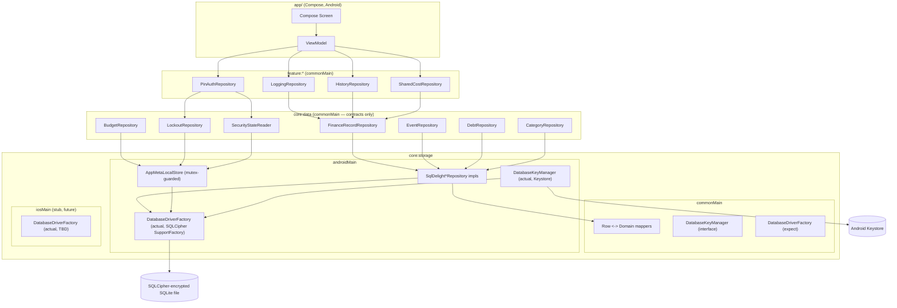
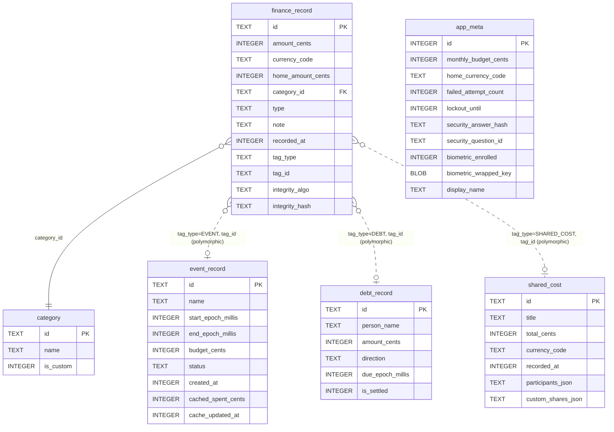
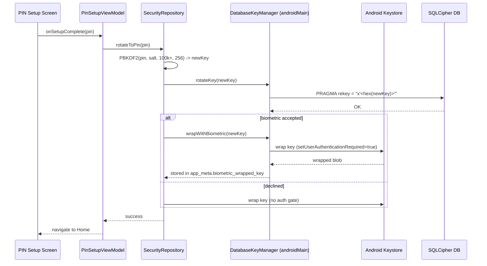

# Pro Expense — Data Layer Detail Design

**Date:** 2026-06-23
**Status:** Draft — brainstorm + proposed design, not yet implemented.
**Scope:** Phase 0 ("Foundation") of `pro-expense-detail-design-plan.md` — A1 (schema), A2/C6
(SQLCipher + key lifecycle), repository implementations, and the commonMain/androidMain/iosMain
seams the iOS-readiness principles require.

**References:**
- `docs/finance_tracker_product.md` — PRD (MVP scope, tech stack: Room/CoreData stated at PRD
  level, superseded by the SQLDelight + SQLCipher decision already locked in code/deps — see §1)
- `pro-expense-detail-design-plan.md` — screen-by-screen integration plan; Phase 0 is the
  prerequisite this document fleshes out
- `docs/module_structure.md` — module/dependency rules
- `AGENTS.md` — repository-pattern + iOS-readiness constraints (non-negotiable)
- Current codebase under `core/domain`, `core/data`, `core/storage`, `feature/*`

---

## 1. Current State Audit

What already exists in the repo (read directly, not assumed):

| Layer | State |
|---|---|
| `core:domain` | ✅ Complete value objects: `Amount` (cents, max-enforced), `Money`, `CurrencyCode`, type-safe `*Id` value classes, `RecordType`, `RecordLink` (sealed: `None`/`ToEvent`/`ToDebt`/`ToSharedCost`), `FinanceRecord`, `Event`, `Debt`, `SharedCost`, `Participant`, `SplitStrategy`, `Category` |
| `core:data` | ✅ Contracts only: `FinanceRecordRepository`, `EventRepository`, `DebtRepository`, `CategoryRepository`, `BudgetRepository`, `LockoutRepository`, `SecurityStateReader`, sealed `Result<T>` |
| `feature:*` | ✅ Contracts only: `LoggingRepository`, `HistoryRepository`, `CurrencyRepository`, `PinAuthRepository`, `SharedCostRepository`, `ImportExportRepository` |
| `core:storage` | ⚠️ **`LocalDataStore` is a one-line stub** (`isAvailable(): Boolean`). No driver, no DAO, no repository implementation exists anywhere in the codebase. |
| SQLDelight schema (`.sq`) | ⚠️ Tables exist for `finance_record`, `event_record`, `debt_record`, `shared_cost`, `app_meta` — **no `category` table**, despite `CategoryRepository` and `Category` existing |
| Dependencies | ✅ Already declared, **unused**: `sqldelight` 2.1.0, `sqlcipher-android` 4.9.0, `androidx-sqlite`/`sqlite-framework`, `androidx-security-crypto`, `androidx-biometric` |
| DI | ❌ None — no Hilt, no Koin, no manual container. `app/src/main` has no `@Database`/DAO/wiring code at all. |
| `shared` module | ⚠️ Only `expect object Platform { val name }`. No ID generation, no Keystore seam, no `iosMain` in `core:storage` yet |

**Conclusion:** the Data Layer is genuinely greenfield. The schema and tech choices are already
decided (SQLDelight + SQLCipher, not Room/CoreData as the PRD's older tech-stack table says —
the code overrides the doc here per `AGENTS.md` precedence). What's missing is everything that
turns those `.sq` files and contracts into a working, encrypted, reactive data layer.

---

## 2. Constraints That Shape the Design

From `AGENTS.md` / `docs/project_philosophy.md` (non-negotiable):

1. **Repository pattern is the only data access path** — no ViewModel/screen touches SQLDelight
   directly, ever (this is also the iOS-readiness seam).
2. **No business logic in `androidMain`** — only literal platform calls (SQLCipher driver
   construction, Keystore Cipher calls) belong there. Row↔domain mapping, validation, and
   coordination logic belong in `commonMain`.
3. **`expect/actual` seams declared now**, even with only an Android `actual` — so iOS is additive
   later, not extracted-after-the-fact.
4. **ViewModels see no Android types** — irrelevant to this doc directly, but it constrains how
   far "down" platform types are allowed to leak (answer: not past `core:storage`'s `androidMain`).
5. Money stored as integer × 100 (`Amount`), max `999,999,999.99` — already enforced in `Amount`'s
   `init` block; the storage layer must not bypass it (i.e., never write raw `Long` without going
   through `Amount`/`Money`).
6. No cloud sync, no migration from the pre-v2 app (F16) — only within-v2 schema evolution needs
   a migration story.

---

## 3. Proposed Architecture

```
Compose screen (app/)
        │
        ▼
ViewModel (app/, commonMain-shaped state)
        │
        ▼
feature:* repository  (e.g. LoggingRepository)   — commonMain, THIN — pure composition/validation,
        │                                            zero platform dependency
        ▼
core:data contracts   (e.g. FinanceRecordRepository) — commonMain interface, no implementation here
        │
        ▼
core:storage impl     (e.g. SqlDelightFinanceRecordRepository) — commonMain logic + androidMain driver
        │
        ▼
SQLDelight Queries → SqlDriver → SQLCipher-encrypted SQLite file
```

### 3.1 Where implementations live (resolves the dependency-rule ambiguity)

`docs/module_structure.md` restricts `feature:*` to depending on `core:domain`/`core:data`/`shared`
(not `core:storage`, except `importexport`). That rule is correct and doesn't need to change —
the trick is that **feature repository implementations never need `core:storage` directly**, only
the `core:data` contract instance, injected:

```kotlin
// feature/logging/src/commonMain — pure composition, no storage dependency
class DefaultLoggingRepository(
    private val financeRecordRepository: FinanceRecordRepository, // core:data contract
) : LoggingRepository {
    override suspend fun createRecord(input: LogRecordInput): Result<FinanceRecord> {
        val record = FinanceRecord(/* map input → domain, generate id */)
        return when (val r = financeRecordRepository.upsert(record)) {
            is Result.Success -> Result.Success(record)
            is Result.Error -> r
        }
    }
    // updateRecord / deleteRecord delegate similarly
}
```

The **real** storage-backed implementation of `FinanceRecordRepository` lives in
`core:storage`'s `androidMain` (it already depends on `core:domain` + `core:data`):

```kotlin
// core:storage/src/androidMain — the only place SQLDelight rows meet domain models
class SqlDelightFinanceRecordRepository(
    private val queries: FinanceRecordQueries,
) : FinanceRecordRepository {
    override suspend fun getAll(): Result<List<FinanceRecord>> = runCatching {
        queries.selectAllRecords().executeAsList().map { it.toDomain() }
    }.toResult()
    // ...
}
```

`app/` is the **composition root**: it builds the `SqlDriver` → `Database` → storage-backed
`core:data` repos → feature repos → ViewModels, in that order, at app start. No DI framework is
required for MVP scope (≈10 repositories); see §7 for the explicit recommendation and the upgrade
path if it later doesn't scale.

### 3.2 The `AppMeta` single-row composite

`app_meta` is one row backing **three** `core:data` contracts (`BudgetRepository`,
`LockoutRepository`, `SecurityStateReader`) plus PIN/biometric fields `PinAuthRepository` will need.
Three independent implementations each doing read-modify-write on the same row is a race condition
waiting to happen (e.g. a failed-PIN-attempt write racing a budget-update write). Recommendation:
one `AppMetaLocalStore` class in `core:storage/androidMain` that owns all reads/writes to that row
behind a `Mutex`, and have `BudgetRepository`/`LockoutRepository`/`SecurityStateReader` implementations
delegate to it rather than touching `AppMetaQueries` independently.

---

## 4. Schema Design

### 4.1 Existing tables — hardened since Phase 0 landed (no migration needed, nothing has shipped)

`finance_record`, `event_record`, `debt_record`, `shared_cost`, `app_meta` already match the domain
models closely (denormalized `participants_json`/`custom_shares_json` for `SharedCost` is a
deliberate, acceptable simplification — no participant table needed since `SplitStrategy` is
recomputed from the JSON, not queried relationally). Two additions landed directly in the v1
`CREATE TABLE` statements (there are zero rows anywhere yet, so this is still the free moment to
reshape them):

- **`finance_record` integrity** — `integrity_algo`/`integrity_hash` columns, stamped and verified by
  `RecordIntegrityVerifier` (a pluggable digest registry — SHA-256 default, MD5 supported) over a
  versioned canonical payload (`FinanceRecord.canonicalPayload()`). Exposed via
  `FinanceRecordRepository.verifyIntegrity(id)`. Deliberately **not** a device-bound Keystore key:
  the digest is portable, so the same mechanism doubles as the import/export verification hash
  without a separate scheme.
- **`event_record` audit + spend cache** — `created_at` (set once on first insert, preserved across
  edits), plus `cached_spent_cents`/`cache_updated_at` — a denormalized running total of
  `finance_record` rows linked via `RecordLink.ToEvent`, recomputed from source of truth (not
  incremented) in the same SQLDelight `transaction { }` as the triggering `FinanceRecordRepository`
  write, including the case where a record's link moves from one event to another. Exposed via
  `EventRepository.getSpent(id): Result<Money>`, read in the table's `homeCurrency` (see below).

`event_record`/`debt_record` intentionally do **not** carry a `currency_code` column —
`budget_cents`/`amount_cents` are interpreted in a single `homeCurrency` supplied by the composition
root from app settings (`SqlDelightEventRepository`/`SqlDelightDebtRepository`), not stored per row.
Multi-currency events/debts (e.g. travel) would need that column revisited as a real follow-up, not
folded in silently here.

### 4.2 Gap: missing `category` table

`CategoryRepository` and `Category` exist with no backing table. Needs `Category.sq`:

```sql
CREATE TABLE category (
    id TEXT NOT NULL PRIMARY KEY,
    name TEXT NOT NULL,
    is_custom INTEGER NOT NULL DEFAULT 0
);

insertCategory:
INSERT OR REPLACE INTO category(id, name, is_custom) VALUES (?, ?, ?);

deleteCategory:
DELETE FROM category WHERE id = ?;

selectAllCategories:
SELECT * FROM category ORDER BY name;
```

Default categories (Food, Transport, etc., per PRD) should be seeded via a `1.sql` migration
insert or an app-start `INSERT OR IGNORE` from a `commonMain` constant list — not hardcoded into
UI, since `Category` rows must exist for `Add Expense`'s category chips (D9) to read from.

### 4.3 Row ↔ domain mapping

SQLDelight auto-generates a data class per table named after the table (e.g. `FinanceRecord` in
package `com.arduia.expense.storage.db` — **same simple name, different package** from
`com.arduia.expense.domain.FinanceRecord`). This is a real foot-gun for readability; mitigate with
explicit, qualified mapper functions, one file per entity, e.g.:

```kotlin
// core:storage/androidMain — com.arduia.expense.storage.db.FinanceRecord → domain.FinanceRecord
private fun com.arduia.expense.storage.db.FinanceRecord.toDomain(): domain.FinanceRecord =
    domain.FinanceRecord(
        id = RecordId(id),
        money = Money(Amount(amount_cents), CurrencyCode(currency_code)),
        homeCurrencyMoney = Money(Amount(home_amount_cents), CurrencyCode(currency_code)),
        categoryId = CategoryId(category_id),
        type = RecordType.valueOf(type),
        note = note,
        recordedAtEpochMillis = recorded_at,
        link = toRecordLink(tag_type, tag_id),
    )

private fun toRecordLink(tagType: String?, tagId: String?): RecordLink = when (tagType) {
    null -> RecordLink.None
    "EVENT" -> RecordLink.ToEvent(EventId(tagId!!))
    "DEBT" -> RecordLink.ToDebt(DebtId(tagId!!))
    "SHARED_COST" -> RecordLink.ToSharedCost(SharedCostId(tagId!!))
    else -> error("Unknown tag_type: $tagType")
}
```

No SQLDelight `ColumnAdapter` is needed for `Amount`/`CurrencyCode` since the columns are plain
`INTEGER`/`TEXT` — the value-class wrapping happens in the mapper, not at the SQL binding layer.
This keeps `.sq` files boring (good) and pushes domain-shape knowledge into `commonMain` Kotlin
(also good — testable without Android).

### 4.4 One-shot vs. reactive reads — recommend adding `Flow` variants now

All `core:data`/`feature:*` contracts are one-shot `suspend fun ... : Result<T>`. That's fine for
writes, but several screens (Home budget summary, Journal list) want to **observe** the DB and
auto-update — currently that would require manual polling or event buses. SQLDelight ships
`sqldelight-coroutines` (already a declared dependency, unused) specifically for this:
`query.asFlow().mapToList(Dispatchers.IO)`.

**Recommendation:** add observe-style methods alongside the existing one-shot ones rather than
replacing them, e.g. `FinanceRecordRepository.observeAll(): Flow<List<FinanceRecord>>`. Keep this
scoped to the two or three repositories that actually back live-updating screens (FinanceRecord,
Event for budgets) rather than doing it everywhere speculatively.

---

## 5. Encryption & Key Management (A2 / C6 / C7)

### 5.1 Driver seam (iOS-ready from day one)

```kotlin
// core:storage/commonMain
expect class DatabaseDriverFactory {
    fun createDriver(passphrase: ByteArray): SqlDriver
}
```

```kotlin
// core:storage/androidMain
actual class DatabaseDriverFactory(private val context: Context) {
    actual fun createDriver(passphrase: ByteArray): SqlDriver =
        AndroidSqliteDriver(
            schema = ProExpenseDatabase.Schema,
            context = context,
            name = "proexpense.db",
            factory = SupportFactory(passphrase), // net.zetetic SQLCipher — drop-in SupportSQLiteOpenHelper.Factory
        )
}
```

`net.zetetic:sqlcipher-android`'s `SupportFactory` implements
`androidx.sqlite.db.SupportSQLiteOpenHelper.Factory`, which is exactly what SQLDelight's
`AndroidSqliteDriver` accepts — no custom bridging code needed beyond this constructor call. Add
an empty `core:storage/src/iosMain/kotlin/.../DatabaseDriverFactory.kt` stub now (per iOS-readiness
principle #2) even though it won't compile against real CoreData/SQLCipher-iOS until that phase —
this also requires adding the `iosMain` source set to `core/storage/build.gradle.kts`, which
doesn't exist yet.

**✅ Done (2026-07-08):** `iosArm64()`/`iosSimulatorArm64()` targets are declared on all 15 KMP
modules (the data-layer spine plus every `feature:*` module), not just `core:storage`. The
`DatabaseDriverFactory.ios.kt` stub now compiles as part of every `verifyIos` run; `createDriver`
itself is still `TODO()` — the real `NativeSqliteDriver` + SQLCipher-iOS implementation is iOS-phase
work, per the iOS-compatibility report's suggested order of work.

### 5.2 Key lifecycle

**Current implementation state (2026-07-08) — differs from the design below, documented here so
the two don't silently disagree:** `DatabaseKeyManager`'s shipped interface has a single method,
`getOrCreateDatabaseKey()` — the DB key is *always* a random 32-byte Keystore-wrapped key, generated
once on first launch and never rotated. The PIN is stored as a PBKDF2 hash in `app_meta.pin_hash`
and acts as a **UI gate** (`PinAuthRepository.verifyPin`), not as the source of the SQLCipher key.
`rotateKey`/`wrapWithBiometric`/`unwrapWithBiometric` below, and the `PRAGMA rekey` lifecycle they
imply, are **not implemented** — `DatabaseKeyManager`'s KDoc marks this as an intentional Phase-0
scope cut ("PIN-derived `PRAGMA rekey` rotation and biometric-gated key wrapping build on top of
this once the storage layer is stable and are intentionally deferred to a later phase"). This means
Screens 14/15's "verification = successful DB open" framing does not hold yet, and the
crash-safety flag below is moot until rotation actually exists. Treat the interface and lifecycle
table below as the target design for that later phase, not the current behavior.

A `DatabaseKeyManager` (commonMain interface, androidMain impl using raw Android Keystore — not
`androidx-security-crypto`'s `EncryptedSharedPreferences`, since biometric-gated per-operation
unwrap needs `KeyGenParameterSpec.Builder().setUserAuthenticationRequired(true)` on the wrapping
key directly, which the higher-level helper doesn't expose):

```kotlin
interface DatabaseKeyManager {
    suspend fun getOrCreateInitialKey(): ByteArray          // random 32 bytes, first launch
    suspend fun rotateKey(newKey: ByteArray): Result<Unit>  // PRAGMA rekey
    suspend fun wrapWithBiometric(key: ByteArray): Result<Unit>
    suspend fun unwrapWithBiometric(): Result<ByteArray>
}
```

Lifecycle, mapped onto the screens in `pro-expense-detail-design-plan.md`:

| Event | Action |
|---|---|
| First app write (no key exists) | `SecureRandom` 32-byte key → wrap in Keystore (no auth gate) → open DB with it |
| PIN Setup (Screen 14) | `PBKDF2(pin, salt, 100_000+, 256)` → `PRAGMA rekey = "x'<hex>'"` on the live connection → discard old key → optionally Keystore-wrap with `setUserAuthenticationRequired(true)` if biometric accepted |
| Disable PIN / Clear All Data (Screen 13) | Reverse rotation: fresh random key → rekey → unwrap requirement removed |
| Forgot PIN recovery (Screen 15) | Routes back into PIN Setup's rotation path — not a separate mechanism |

**Crash-safety flag (carried over, still open):** `PRAGMA rekey` atomicity on Android needs explicit
testing (kill the process mid-rekey) before Phase 6 sign-off — back up the DB file before issuing
the pragma until that's confirmed safe.

---

## 6. Cross-Cutting Utilities Needed in `shared`

- **ID generation**: project is on Kotlin 2.4, where `kotlin.uuid.Uuid` is multiplatform-stable —
  no `expect/actual` needed; repository implementations (or domain factory functions) can call
  `Uuid.random().toString()` directly in `commonMain`. Cheaper than rolling a custom expect/actual.
- **`iosMain` stubs**: ✅ Done (2026-07-08) — `androidMain`/`iosMain` source sets exist on all 15
  KMP modules, not just `core:storage`; `verifyIos` compiles every module's `commonMain` for
  `iosSimulatorArm64` as a standing Gradle task.
- **Crypto/time seams added beyond the original design**: `currentEpochMillis()`,
  `platformPbkdf2Sha256()`, `secureRandomBytes()`, and `ByteArray.toHexString()` joined
  `platformDigestHex()` in `shared` — needed to move the storage repositories and
  `PinAuthRepository`'s implementation out of `androidMain` (see the iOS-compatibility report's G2/G3).

---

## 7. Dependency Injection / Composition Root

No DI framework exists. Two options:

| Option | Trade-off |
|---|---|
| **Manual `AppContainer`** (recommended for MVP) | A single `object`/class in `app/` that constructs the `SqlDriver` → `Database` → repos → feature repos in dependency order, exposed as plain `val`s. Zero new dependency, trivial to read end-to-end, fine at this repo count (~10-15 repositories total). |
| Koin | KMP-compatible, low ceremony — worth revisiting once repository count or ViewModel-scoping complexity grows (e.g. once `iosApp` needs the same graph). Not justified yet. |

Recommendation: ship the manual `AppContainer` now; it's a few dozen lines and avoids introducing
a dependency decision (`Step 2.5` gate) that isn't needed yet. Revisit if Phase 2+ wiring gets
unwieldy.

---

## 8. Testing Strategy

Per `AGENTS.md`'s "fakes at repository boundary" rule:

- **Feature/ViewModel tests**: fake `core:data` implementations in-memory (e.g.
  `FakeFinanceRecordRepository` backed by a `MutableList`) — no SQLDelight, no Robolectric.
- **Storage-layer repository tests**: SQLDelight's `JdbcSqliteDriver` (in-memory, unencrypted,
  pure JVM) in `core:storage`'s `commonTest`/`androidUnitTest` — tests the real SQL + real mapper
  code, just not the SQLCipher wrapping. This is the backbone test for each
  `SqlDelight*Repository`.
- **Encryption smoke test**: a small, separate Android-only test that opens a DB with
  `SupportFactory`, writes, closes, reopens with the same key (succeeds), reopens with a wrong key
  (fails) — proves the SQLCipher wiring itself, decoupled from business-logic repository tests.

---

## 9. Migration & Versioning

SQLDelight tracks schema as numbered `.sq`/`.sqm` files. Treat the schema assembled in §4 as
**version 1**. Any future column/table change ships as a `2.sqm` migration file, and
`verifySqlDelightMigration` (Gradle task SQLDelight provides) should be added to `verifyAll` once
the first real migration exists — not needed before then. This is purely about in-place schema
evolution; per `F16` there is no migration path from the pre-v2 app's database.

---

## 10. Open Questions / Risks

| Item | Notes |
|---|---|
| `PRAGMA rekey` atomicity on Android | Needs explicit kill-mid-rekey test before Phase 6 sign-off (carried from detail-design-plan) |
| Flow-based observe methods scope | Recommend starting with `FinanceRecord` + `Event` only, not all repositories |
| `AppMetaLocalStore` mutex | Needed once `PinAuthRepository`'s implementation is added — same row, fourth writer |
| Category seeding | Default categories need a seed mechanism (migration insert vs. app-start `INSERT OR IGNORE`) — pick one before Phase 1 lands |
| DI framework | Manual container now; revisit only if/when iOS wiring duplicates it significantly |

---

## 11. Diagrams

### 11.1 Layered architecture & module ownership



### 11.2 Schema (entity relationships)



### 11.3 Key lifecycle sequence (PIN Setup → rekey)



---

## 12. Suggested Build Sequence (Phase 0, sequenced)

1. Add `category.sq`; seed default categories.
2. Add `androidMain`/`iosMain` source sets to `core:storage`; declare `DatabaseDriverFactory` expect/actual.
3. Wire SQLCipher `SupportFactory` into the Android `actual` driver; implement `DatabaseKeyManager` (Android Keystore).
4. Implement first-launch random-key bootstrap (no PIN yet) — this unblocks every other repository.
5. Implement `core:data` repositories in `core:storage/androidMain` (`FinanceRecordRepository` first — it's the most-consumed contract), with mapper functions per §4.3.
6. Implement `AppMetaLocalStore` + the three repositories that share it (`BudgetRepository`, `LockoutRepository`, `SecurityStateReader`).
7. Implement thin `feature:*` adapter repositories (`DefaultLoggingRepository`, etc.) per §3.1.
8. Build the manual `AppContainer` composition root in `app/`.
9. Backbone tests per §8 for each repository as it lands — not batched at the end.
10. Only then: PIN Setup's `PRAGMA rekey` flow (§5.2), which depends on steps 1-8 being stable.
